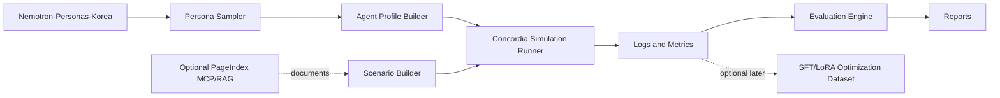

# Korean Social Simulation Lab

Korean Social Simulation Lab is a specification-driven Python project for building synthetic Korean social simulations with Concordia, Nemotron-Personas-Korea, optional PageIndex MCP/RAG, and strict safety/evaluation guardrails. It is designed to test hypotheses about product reaction, marketing risk, community dynamics, rumor response, service operation, policy communication, organization change, and game NPC social worlds before real-user validation.

## Problem Statement

Teams often need to understand how different user or community archetypes may react to products, messages, rules, crises, or social situations. Real user studies are expensive, slow, and ethically sensitive. Simple LLM roleplay is too unstructured and hard to evaluate. This project provides a controlled, reproducible simulation pipeline where synthetic Korean personas become Concordia agents, interact in configured scenarios, and produce auditable logs and metrics.

The system is not a real-world forecasting engine. It is a hypothesis-generation and risk-analysis tool.

## Target Users

- AI builders designing multi-agent simulations.
- Product teams testing messaging, pricing, onboarding, and usability hypotheses.
- Community operators testing rules, moderation, and conflict prevention strategies.
- Policy and communication teams testing public notice clarity and trust risks.
- Game designers building Korean social-world NPC simulations.
- Researchers studying synthetic social simulation methodology.

## Key Features

- Load and sample Korean synthetic personas from `nvidia/Nemotron-Personas-Korea`.
- Convert persona rows into structured Concordia agent profiles.
- Run scenario categories including:
  - Product and price reaction.
  - Marketing and viral spread risk.
  - Rumor and crisis response.
  - Conflict and mediation.
  - Policy and notice acceptance.
  - Community operation.
  - Organization and negotiation.
  - Game NPC and social-world simulation.
- Optionally ground scenarios with PageIndex MCP/RAG for product docs, policies, reports, historical notes, and prior logs.
- Collect JSONL logs, run metadata, and aggregate metrics.
- Generate markdown reports.
- Enforce safety rules against political manipulation, real-person profiling, protected-group targeting, and fake influence campaigns.

## High-Level Architecture



## Installation

```bash
git clone <repository-url>
cd korean-social-simulation-lab
uv sync
```

Expected Python version: 3.11 or newer.

## Usage

Dry-run a scenario without LLM calls:

```bash
uv run kssim run --config examples/run_product_reaction.yaml --dry-run
```

Run a configured simulation:

```bash
uv run kssim run --config examples/run_product_reaction.yaml
```

Generate a report from an existing run directory:

```bash
uv run kssim report --input outputs/product_reaction_run_001 --output outputs/product_reaction_run_001/report.md
```

Complete MVP pipeline from config to report using the example `run_id: product_reaction_run_001`:

```bash
uv run kssim validate-config --config examples/run_product_reaction.yaml
uv run kssim sample --config examples/run_product_reaction.yaml --output outputs/product_reaction_run_001/sample.json
uv run kssim compile-scenario --config examples/run_product_reaction.yaml --output outputs/product_reaction_run_001/plan.json
uv run kssim run --config examples/run_product_reaction.yaml --dry-run
uv run kssim evaluate --events outputs/product_reaction_run_001/events.jsonl --config examples/run_product_reaction.yaml
uv run kssim report --input outputs/product_reaction_run_001 --output outputs/product_reaction_run_001/report.md
```

## Development Workflow

1. Load and validate YAML config with environment overrides.
2. Load personas from fixture data or Hugging Face.
3. Sample a deterministic population and build agent profiles.
4. Compile a supported scenario family and attach optional RAG context.
5. Validate the plan and profiles against the safety policy.
6. Execute a dry-run loop or the Concordia adapter boundary.
7. Persist `events.jsonl`, evaluate metrics, and render a markdown report.

## Testing

```bash
uv run pytest
uv run ruff check .
uv run mypy src
```

Test categories:

- Unit tests for data models, validation, samplers, adapters, metrics, and safety guards.
- Integration tests for dataset sampling, scenario compilation, optional RAG adapters, and log writing.
- Smoke tests for end-to-end dry-run simulations.
- Golden tests for deterministic reports and metric outputs.

## Configuration

Configuration is YAML-first with environment variable overrides.

Expected files:

```txt
configs/local.example.yaml
configs/scenarios.example.yaml
configs/safety.example.yaml
```

Expected environment variables:

```bash
KSSIM_LLM_PROVIDER=<provider-name>
KSSIM_LLM_MODEL=<model-name>
KSSIM_LLM_API_KEY=<secret>
KSSIM_HF_CACHE_DIR=<optional-local-cache-dir>
KSSIM_PAGEINDEX_API_KEY=<optional-secret>
KSSIM_OUTPUT_DIR=outputs
```

Secrets must be provided through environment variables or a local ignored `.env` file, never committed.

## Project Status

MVP implementation complete. Tasks 1.1 through 7.3 completed per specification.

## References

- Concordia: https://github.com/google-deepmind/concordia
- Nemotron-Personas-Korea: https://huggingface.co/datasets/nvidia/Nemotron-Personas-Korea
- PageIndex: https://github.com/VectifyAI/PageIndex
- PageIndex MCP: https://docs.pageindex.ai/mcp

## License

Apache-2.0 for project code, while respecting third-party licenses and dataset attribution requirements.
