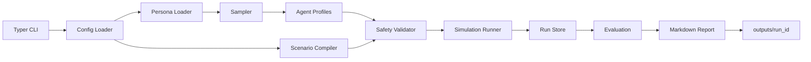

# Argus: Korean Social Simulation Lab

Argus is a specification-driven Python project for deterministic, auditable synthetic Korean social simulation. It loads synthetic Korean persona records, builds structured agent profiles, compiles safe scenario plans, runs offline dry-run simulations or optional live adapters, stores JSONL artifacts, evaluates metrics, and renders Markdown reports.

## Problem Statement

Teams often need to explore how different synthetic archetypes may react to product messages, rules, service policies, crisis communication, or game scenarios. Argus provides a typed, reproducible pipeline with configuration, sampling, safety checks, logs, metrics, and reports.

Argus is not a real-world forecasting engine. Outputs are synthetic and must be validated through real user research, expert review, or controlled experiments before product, policy, or operational decisions are made.

## Target Users

- AI builders designing multi-agent simulations.
- Product teams testing messaging, pricing, onboarding, and usability hypotheses.
- Community operators testing rules, moderation, and conflict prevention strategies.
- Policy and communication teams testing public notice clarity and trust risks.
- Game designers building Korean social-world NPC simulations.
- Researchers studying synthetic social simulation methodology.

## Key Features

- YAML-first runtime configuration.
- Local JSONL fixture loading for offline tests.
- Optional Hugging Face loading for `nvidia/Nemotron-Personas-Korea`.
- Deterministic persona sampling.
- Chat and attachment metadata validation for simulation input.
- Deterministic persona selection with reasons and confidence scores.
- Agent profile generation.
- Scenario family registry and compiler.
- Safety validation for prohibited English and Korean phrases.
- Network-free dry-run simulation with structured evaluation and discussion events.
- Optional live adapter boundaries for Concordia and NVIDIA NIM.
- Run artifact storage.
- Metric evaluation.
- Markdown report rendering.
- Strict verification workflow.

## High-Level Architecture


```mermaid
flowchart LR
    CLI[Typer CLI] --> Config[Config Loader]
    Config --> Loader[Persona Loader]
    Loader --> Sampler[Sampler]
    Sampler --> Profiles[Agent Profiles]
    Config --> Scenario[Scenario Compiler]
    Profiles --> Safety[Safety Validator]
    Scenario --> Safety
    Safety --> Runner[Simulation Runner]
    Runner --> Store[Run Store]
    Store --> Eval[Evaluation]
    Eval --> Report[Markdown Report]
    Report --> Artifacts[outputs/run_id]
```

## Installation

```bash
git clone <repository-url>
cd Argus
uv sync --extra dev
```

Python 3.11 or newer is required.

Optional integrations:

```bash
uv sync --extra hf
uv sync --extra llm
uv sync --extra concordia
uv sync --extra bridge
uv sync --extra all
```

## Usage

Validate config:

```bash
uv run kssim validate-config --config examples/run_product_reaction.yaml
```

Sample personas:

```bash
uv run kssim sample --config examples/run_product_reaction.yaml --output outputs/product_reaction_run_001/sample.json
```

Compile scenario:

```bash
uv run kssim compile-scenario --config examples/run_product_reaction.yaml --output outputs/product_reaction_run_001/plan.json
```

Run offline dry-run:

```bash
uv run kssim run --config examples/run_product_reaction.yaml --dry-run
```

The example keeps `runtime.overwrite: false`, so repeat runs with the same `run_id` intentionally fail if `events.jsonl` already exists. Remove the existing run directory, choose a new `runtime.run_id`, or set `runtime.overwrite: true` for intentional regeneration.

Evaluate:

```bash
uv run kssim evaluate --events outputs/product_reaction_run_001/events.jsonl --config examples/run_product_reaction.yaml
```

Report:

```bash
uv run kssim report --input outputs/product_reaction_run_001 --output outputs/product_reaction_run_001/report.md
```

Bridge utilities:

```bash
uv run kssim bridge validate-config --config configs/bridge.example.yaml
uv run kssim bridge export-replay --events outputs/product_reaction_run_001/events.jsonl --output outputs/product_reaction_run_001/bridge.jsonl
uv run kssim bridge serve --config configs/bridge.example.yaml
```

The bridge server requires `uv sync --extra bridge`. Physical events use a deterministic local fallback (no external physics engine required). `export-replay` converts existing Argus event logs into versioned bridge JSONL and fails if the output file already exists.

Start the bridge, open the Unity EmbodiedDebate scene (`unity/EmbodiedDebate`) in play mode so the client connects with `unity.ready`, then the client automatically `POST`s `/simulation/start` to stream dry-run events over the same WebSocket. The request can include `chat_text` plus attachment metadata (`path`, optional `media_type`, optional `size_bytes`). The bridge emits `agent.spawn`, adapted simulation envelopes, deterministic discussion/evaluation events, and deterministic `agent.move` commands. When profiles contain two or more agents, a deterministic `physics.result` envelope is also emitted.

`configs/bridge.example.yaml` uses deterministic local fallback by default. `GET /health` reports `physics.backend` as `fallback`. The Unity project lists `com.unity.modules.unitywebrequest` so `BridgeReceiver` can `POST` `/simulation/start`.
Expected dry-run artifacts:

```txt
outputs/product_reaction_run_001/
  run_metadata.json
  sample.json
  profiles.json
  plan.json
  input_summary.json
  persona_selection.json
  individual_evaluations.json
  events.jsonl
  metrics.json
  metrics.csv
  report.md
  bridge.jsonl
```

## Development Workflow

1. Load and validate YAML config with environment overrides.
2. Load personas from fixture data or Hugging Face.
3. Sample a deterministic population and build agent profiles.
4. Validate chat and attachment metadata without executing file content.
5. Select up to 20 personas with deterministic reasons and confidence scores.
6. Compile a supported scenario family; compiler-level RAG context can be attached by adapter code.
7. Validate the plan and profiles against the safety policy.
8. Execute a dry-run loop or the Concordia adapter boundary.
9. Persist `events.jsonl`, selection/evaluation artifacts, metrics, and a markdown report.

## Testing

```bash
uv run pytest
uv run ruff check .
uv run mypy src
```

Test categories:

- Unit tests for data models, validation, samplers, adapters, metrics, and safety guards.
- Integration tests for dataset sampling, scenario compilation, optional RAG adapters, and log writing.
- Smoke tests for end-to-end dry-run simulations.
- Golden tests for deterministic reports and metric outputs.

## Configuration

Configuration is YAML-first with environment variable overrides.

Optional runtime sections:

- `input.chat_text`: user prompt used by deterministic selection and dry-run discussion.
- `input.attachments`: attachment metadata only; content is not executed.
- `input.attachment_policy`: allowed extensions, count limit, and byte-size limit.
- `persona_selection.enabled`: opt-in for CLI runs; the Unity bridge enables selection for `/simulation/start`.
- `persona_selection.max_personas`: capped at 20 when selection is enabled.
- `persona_memory.enabled`: opt-in only; when enabled, Argus writes proposal, backup, diff, and rollback artifacts without applying updates by default.

Expected environment variables:

```bash
KSSIM_LLM_API_KEY=<optional-secret>
NVIDIA_API_KEY=<optional-secret-for-nvidia-nim>
KSSIM_HF_CACHE_DIR=<optional-local-cache-dir>
KSSIM_PAGEINDEX_API_KEY=<optional-secret>
KSSIM_OUTPUT_DIR=outputs
BRIDGE_HOST=127.0.0.1
BRIDGE_PORT=8765
UNITY_CLIENT_TOKEN=<optional-local-token>
LOG_LEVEL=INFO
```

Secrets must be provided through environment variables or a local ignored `.env` file, never committed.

## Project Status

Current stable path: deterministic offline MVP with fixture personas and `kssim run --dry-run`.

Experimental optional paths: Hugging Face loading, Concordia adapter boundary, mocked PageIndex/RAG adapter boundary, NVIDIA NIM live LLM calls, and the local Unity bridge schema/adapter foundation. Live RAG is not wired into the CLI pipeline yet and is not required for offline tests. The bridge server runtime uses the optional `bridge` extra and safe localhost defaults in `configs/bridge.example.yaml`.

## References

- Concordia: https://github.com/google-deepmind/concordia
- Nemotron-Personas-Korea: https://huggingface.co/datasets/nvidia/Nemotron-Personas-Korea
- PageIndex: https://github.com/VectifyAI/PageIndex
- PageIndex MCP: https://docs.pageindex.ai/mcp

## License

Apache-2.0 for project code, while respecting third-party licenses and dataset attribution requirements.

---

## Related Project

[OpenLife Market](https://topabaem05.github.io/openlife-market/) - Autonomous AI agents that must sell their own research to survive. Live experiment based on arXiv:2606.31046.

---

## Related Project

[OpenLife Market](https://topabaem05.github.io/openlife-market/) - Autonomous AI agents that must sell their own research to survive. Live experiment based on arXiv:2606.31046.
