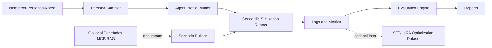
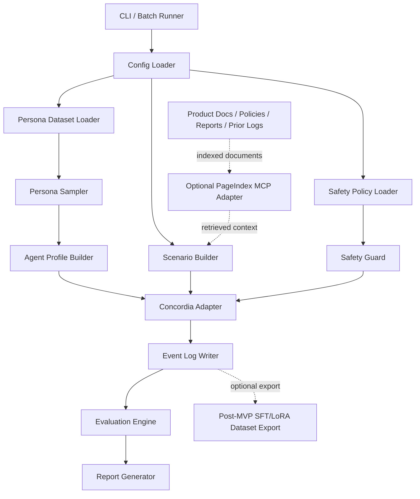
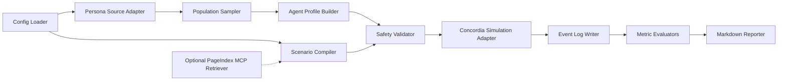

===== FILE: AGENTS.md =====

# AGENTS.md

## Project Overview

Korean Social Simulation Lab is a greenfield Python project for running synthetic, auditable social simulations using:

- `gdm-concordia` as the generative agent-based simulation engine.
- `nvidia/Nemotron-Personas-Korea` as the structured synthetic Korean persona source.
- Optional PageIndex MCP/RAG as a document-grounding layer for product documents, policies, rules, reports, scenario evidence, and prior simulation logs.
- Optional later SFT/LoRA fine-tuning only as a post-MVP optimization step, never as the default architecture.

The project helps researchers, product teams, game designers, community operators, and policy/communications teams test hypotheses about product reaction, marketing risk, community conflict, rumor response, service operation, policy acceptance, organization dynamics, and NPC social worlds before running real-user studies.

This project must not be used to infer real individuals' political orientation, target protected groups, manipulate voters, create fake grassroots activity, or optimize divisive political persuasion.

## Repository Map

Expected structure:

```txt
.
├── AGENTS.md
├── README.md
├── pyproject.toml
├── uv.lock
├── configs/
│   ├── local.example.yaml
│   ├── scenarios.example.yaml
│   └── safety.example.yaml
├── data/
│   ├── raw/                  # ignored; downloaded datasets or local parquet files
│   ├── cache/                # ignored; HF/Polars/DuckDB cache
│   └── samples/              # small non-sensitive test fixtures only
├── docs/
│   ├── architecture.md
│   ├── coding-style.md
│   └── adr/
├── examples/
│   ├── run_product_reaction.yaml
│   ├── run_rumor_response.yaml
│   └── run_game_npc_world.yaml
├── outputs/                  # ignored; generated simulation logs and reports
├── src/
│   └── korean_social_simulator/
│       ├── __init__.py
│       ├── cli.py
│       ├── config/
│       ├── data/
│       ├── personas/
│       ├── agents/
│       ├── scenarios/
│       ├── simulation/
│       ├── rag/
│       ├── evaluation/
│       ├── safety/
│       ├── storage/
│       └── reporting/
├── specs/
│   └── korean-social-simulation/
└── tests/
    ├── unit/
    ├── integration/
    ├── smoke/
    └── golden/
```

## Agent Operating Rules

- Do not implement unrelated features.
- Do not rewrite unrelated modules.
- Do not remove tests unless the active spec explicitly requires it.
- Do not fake test results.
- Do not claim success unless verification was actually performed.
- Prefer small, reviewable changes.
- Preserve public interfaces unless the spec says otherwise.
- Ask for clarification only if a requirement blocks implementation.
- If ambiguity exists, choose the safest minimal interpretation and document the assumption.
- Never add political persuasion, voter targeting, or protected-class targeting features.
- Never treat synthetic personas as real people or real population forecasts.
- Never log secrets, API keys, raw LLM prompts containing credentials, or private user documents.
- Always add or update tests for new behavior.
- Always update docs when behavior changes.
- Always report exact commands run and exact results.

## Development Commands

Use `uv` as the default Python project manager.

```bash
# Install dependencies
uv sync

# Run CLI help
uv run kssim --help

# Run one smoke scenario
uv run kssim run --config examples/run_product_reaction.yaml --dry-run

# Run tests
uv run pytest

# Run unit tests only
uv run pytest tests/unit

# Run lint
uv run ruff check .

# Format
uv run ruff format .

# Type check
uv run mypy src

# Run all local checks
uv run pytest && uv run ruff check . && uv run mypy src
```

If a command is unavailable because the project has not yet been bootstrapped, the implementing agent must report that clearly and create the missing project infrastructure only when the current task requires it.

## Code Quality Rules

- Python 3.11+ required.
- Type hints are required for all public functions, methods, dataclasses, Pydantic models, and protocol interfaces.
- Use clear module boundaries: data loading, persona sampling, agent building, scenario building, simulation execution, RAG, evaluation, safety, storage, and reporting must remain separate.
- No hidden network calls. Network use must be explicit through dataset loading, LLM calls, PageIndex MCP calls, or configured document sources.
- Explicit error handling required. No broad `except Exception` unless errors are re-raised or converted into a typed project error.
- Deterministic tests required. Use seeds and fixtures.
- No global mutable state unless justified and covered by tests.
- No credentials in source code, tests, fixtures, docs, or committed config files.
- Large datasets and generated logs must not be committed.
- Public APIs must be stable once defined in the spec.

## Safety Rules

- Allowed: synthetic persona experiments for product reaction, usability, community moderation, conflict prevention, rumor response, service operations, educational communication, healthcare communication, financial literacy, policy communication, and game/NPC worlds.
- Disallowed: targeted political persuasion, voter manipulation, protected-class exploitation, identity inference on real users, fake grassroots generation, covert influence operations, malware/social-engineering optimization, and automated harassment.
- Political or sensitive scenarios must be framed as safety, conflict mitigation, misinformation resistance, or communication clarity experiments.
- Outputs must include uncertainty notes and must not be presented as real-world prediction without external validation.

## Completion Criteria

Done when:

- All acceptance criteria are satisfied.
- All required tests pass.
- New behavior is covered by tests.
- Existing behavior is not broken.
- No unrelated files are modified.
- Documentation is updated.
- Safety constraints are preserved.
- The agent reports exact commands run and their results.


===== FILE: README.md =====

# Korean Social Simulation Lab

Korean Social Simulation Lab is a specification-driven Python project for building synthetic Korean social simulations with Concordia, Nemotron-Personas-Korea, optional PageIndex MCP/RAG, and strict safety/evaluation guardrails. It is designed to test hypotheses about product reaction, marketing risk, community dynamics, rumor response, service operation, policy communication, organization change, and game NPC social worlds before real-user validation.

## Problem Statement

Teams often need to understand how different user or community archetypes may react to products, messages, rules, crises, or social situations. Real user studies are expensive, slow, and ethically sensitive. Simple LLM roleplay is too unstructured and hard to evaluate. This project provides a controlled, reproducible simulation pipeline where synthetic Korean personas become Concordia agents, interact in configured scenarios, and produce auditable logs and metrics.

The system is not a real-world forecasting engine. It is a hypothesis-generation and risk-analysis tool.

## Target Users

- AI builders designing multi-agent simulations.
- Product teams testing messaging, pricing, onboarding, and usability hypotheses.
- Community operators testing rules, moderation, and conflict prevention strategies.
- Policy and communication teams testing public notice clarity and trust risks.
- Game designers building Korean social-world NPC simulations.
- Researchers studying synthetic social simulation methodology.

## Key Features

- Load and sample Korean synthetic personas from `nvidia/Nemotron-Personas-Korea`.
- Convert persona rows into structured Concordia agent profiles.
- Run scenario categories including:
  - Product and price reaction.
  - Marketing and viral spread risk.
  - Rumor and crisis response.
  - Conflict and mediation.
  - Policy and notice acceptance.
  - Community operation.
  - Organization and negotiation.
  - Game NPC and social-world simulation.
- Optionally ground scenarios with PageIndex MCP/RAG for product docs, policies, reports, historical notes, and prior logs.
- Collect JSONL logs and aggregate metrics.
- Generate markdown/CSV reports.
- Enforce safety rules against political manipulation, real-person profiling, protected-group targeting, and fake influence campaigns.

## High-Level Architecture



## Installation

```bash
git clone <repository-url>
cd korean-social-simulation-lab
uv sync
```

Expected Python version: 3.11 or newer.

## Usage

Dry-run a scenario without LLM calls:

```bash
uv run kssim run --config examples/run_product_reaction.yaml --dry-run
```

Run a configured simulation:

```bash
uv run kssim run --config examples/run_product_reaction.yaml
```

Generate a report from existing logs:

```bash
uv run kssim report --input outputs/product_reaction/run_001/events.jsonl --output outputs/product_reaction/run_001/report.md
```

## Development Workflow

1. Read `AGENTS.md`.
2. Read the active feature spec under `specs/korean-social-simulation/`.
3. Select the next unchecked task in `tasks.md`.
4. Implement only that task.
5. Add or update tests.
6. Run required verification commands.
7. Report exact commands and results.

## Testing

```bash
uv run pytest
uv run ruff check .
uv run mypy src
```

Test categories:

- Unit tests for data models, validation, samplers, adapters, metrics, and safety guards.
- Integration tests for dataset sampling, scenario compilation, optional RAG adapters, and log writing.
- Smoke tests for end-to-end dry-run simulations.
- Golden tests for deterministic reports and metric outputs.

## Configuration

Configuration is YAML-first with environment variable overrides.

Expected files:

```txt
configs/local.example.yaml
configs/scenarios.example.yaml
configs/safety.example.yaml
```

Expected environment variables:

```bash
KSSIM_LLM_PROVIDER=<provider-name>
KSSIM_LLM_MODEL=<model-name>
KSSIM_LLM_API_KEY=<secret>
KSSIM_HF_CACHE_DIR=<optional-local-cache-dir>
KSSIM_PAGEINDEX_API_KEY=<optional-secret>
KSSIM_OUTPUT_DIR=outputs
```

Secrets must be provided through environment variables or a local ignored `.env` file, never committed.

## Project Status

Specification phase. No implementation should be assumed complete until tasks are implemented and verification passes.

## Roadmap

1. Bootstrap package, CLI, config loader, and typed models.
2. Add Nemotron persona dataset loader and deterministic sampler.
3. Add persona-to-agent profile conversion.
4. Add scenario templates and safety guardrails.
5. Add Concordia simulation runner adapter.
6. Add JSONL log storage and evaluation metrics.
7. Add optional PageIndex MCP/RAG integration.
8. Add reporting and golden tests.
9. Add optional later SFT/LoRA dataset export.

## References

- Concordia: https://github.com/google-deepmind/concordia
- Nemotron-Personas-Korea: https://huggingface.co/datasets/nvidia/Nemotron-Personas-Korea
- PageIndex: https://github.com/VectifyAI/PageIndex
- PageIndex MCP: https://docs.pageindex.ai/mcp

## License

TBD. Recommended project license: Apache-2.0 for project code, while respecting third-party licenses and dataset attribution requirements.


===== FILE: docs/architecture.md =====

# Architecture

## System Context

Korean Social Simulation Lab sits between structured synthetic persona data, LLM-powered generative agents, optional document retrieval, and downstream evaluation/reporting.

External systems:

- Hugging Face Datasets: source for `nvidia/Nemotron-Personas-Korea`.
- Concordia: simulation engine for generative agent-based modeling.
- LLM provider: configurable text generation backend used by Concordia and optional evaluators.
- Text embedder: required if Concordia associative memory is enabled.
- PageIndex MCP: optional document grounding layer for vectorless reasoning-based retrieval.
- Local filesystem: configuration, generated logs, metrics, reports, and cached data.

The system must be built as a reproducible local-first pipeline. Network access is explicit and configurable.

## Architecture Diagram



## Module Responsibilities

### `config`

- Purpose: Load and validate YAML config plus environment overrides.
- Inputs: YAML paths, environment variables, CLI overrides.
- Outputs: typed runtime config object.
- Main responsibilities:
  - Validate required keys.
  - Resolve output paths.
  - Apply defaults.
  - Redact secrets for logs.
- Failure behavior: fail fast with `ConfigurationError` and field-level messages.
- Test strategy: unit tests for valid configs, missing keys, invalid types, secret redaction, and environment overrides.

### `data`

- Purpose: Provide access to persona datasets and local fixture data.
- Inputs: dataset name, split, cache directory, optional local parquet path.
- Outputs: iterable or table-like persona rows.
- Main responsibilities:
  - Load Hugging Face dataset or local parquet.
  - Support offline fixture mode.
  - Expose schema validation.
  - Avoid committing large raw data.
- Failure behavior: raise `DatasetLoadError` for missing datasets, unavailable cache, incompatible schema, or network failure.
- Test strategy: unit tests with small fixtures; integration test behind marker for actual HF dataset loading.

### `personas`

- Purpose: Sample and normalize synthetic personas.
- Inputs: raw persona rows, sampling constraints, random seed.
- Outputs: `PersonaRecord` and `PopulationSample` objects.
- Main responsibilities:
  - Validate fields.
  - Filter by region, age range, occupation, interests, and scenario needs.
  - Sample deterministically.
  - Attach sampling metadata.
- Failure behavior: raise `SamplingError` if filters produce too few rows or invalid constraints.
- Test strategy: deterministic fixture-based tests and edge cases for empty samples.

### `agents`

- Purpose: Convert personas into Concordia-ready agent profiles.
- Inputs: `PersonaRecord`, agent template, safety policy.
- Outputs: `AgentProfile` objects containing background, memory seeds, goals, constraints, and speech guidelines.
- Main responsibilities:
  - Map persona fields to agent background.
  - Create initial memory and goals.
  - Prevent unsafe profile labels or real-user inference.
  - Preserve Korean language behavior where configured.
- Failure behavior: raise `AgentProfileError` for missing required fields or unsafe labels.
- Test strategy: snapshot/golden tests for profile rendering and safety filtering.

### `scenarios`

- Purpose: Compile scenario templates into executable simulation plans.
- Inputs: scenario YAML, selected category, optional RAG context, safety policy.
- Outputs: `ScenarioSpec` and `SimulationPlan`.
- Main responsibilities:
  - Support scenario families:
    - product and price reaction
    - marketing and viral risk
    - rumor and crisis response
    - conflict and mediation
    - policy and notice acceptance
    - community operation
    - organization and negotiation
    - game NPC social worlds
  - Validate participant counts and episode length.
  - Define metrics to collect.
  - Declare non-goals and forbidden objectives.
- Failure behavior: raise `ScenarioValidationError` for unsafe or incomplete scenario specs.
- Test strategy: schema tests, golden compiled scenarios, safety rejection tests.

### `rag`

- Purpose: Optional document retrieval for grounding scenario facts.
- Inputs: query, document collection ID, PageIndex API key, MCP client config.
- Outputs: `RetrievedContext` with citation metadata.
- Main responsibilities:
  - Retrieve document sections.
  - Preserve page/section references where available.
  - Fail closed when required grounding is unavailable.
  - Allow no-RAG mode.
- Failure behavior: raise `RetrievalError` or return typed unavailable status depending on scenario config.
- Test strategy: mocked MCP tests, timeout tests, no-RAG tests, citation preservation tests.

### `simulation`

- Purpose: Orchestrate Concordia execution.
- Inputs: `SimulationPlan`, agent profiles, scenario spec, LLM config, embedder config.
- Outputs: event stream and final simulation result.
- Main responsibilities:
  - Build Concordia agents and Game Master.
  - Run deterministic turn loops when possible.
  - Collect observations, actions, GM decisions, and metrics hooks.
  - Enforce max turns and budget limits.
- Failure behavior: return `SimulationResult` with status `failed` or `partial`; persist partial logs if safe.
- Test strategy: dry-run adapter tests, mocked LLM tests, turn-limit tests, failure recovery tests.

### `safety`

- Purpose: Enforce safety policies before and during simulation.
- Inputs: scenario spec, agent profiles, generated content, metric requests.
- Outputs: allow/block decisions and audit notes.
- Main responsibilities:
  - Block political persuasion targeting, real-person profiling, protected-group exploitation, harassment, and fake influence operations.
  - Require aggregate-only reporting.
  - Add uncertainty notes.
  - Redact sensitive text from logs where configured.
- Failure behavior: raise `SafetyViolationError` before execution or stop a run with blocked status.
- Test strategy: adversarial scenario tests and policy regression tests.

### `evaluation`

- Purpose: Convert logs into metrics.
- Inputs: JSONL event logs, scenario metrics config.
- Outputs: typed metric results, CSV, and report sections.
- Main responsibilities:
  - Compute share intent, trust score, backlash, confusion, conflict intensity, consensus, conversion intent, dropout intent, and policy acceptance.
  - Separate synthetic observations from real validation.
  - Support deterministic rule-based metrics and optional LLM judges.
- Failure behavior: return partial metrics with explicit errors for unsupported metrics.
- Test strategy: unit tests over golden logs and deterministic metric fixtures.

### `storage`

- Purpose: Persist runs, logs, metrics, and reports.
- Inputs: events, run metadata, output directory.
- Outputs: JSONL, JSON, CSV, Markdown files.
- Main responsibilities:
  - Atomic writes where practical.
  - Stable file naming.
  - Metadata capture.
  - Prevent accidental overwrite unless configured.
- Failure behavior: raise `StorageError`; keep temporary files identifiable.
- Test strategy: tempdir tests for write/read, overwrite protection, invalid path handling.

### `reporting`

- Purpose: Produce human-readable outputs.
- Inputs: run metadata, metric outputs, safety notes, selected examples.
- Outputs: Markdown report and optional CSV summaries.
- Main responsibilities:
  - Summarize hypothesis results.
  - Include limitations and uncertainty.
  - Include safety notes.
  - Avoid unsupported claims.
- Failure behavior: emit report with partial sections and explicit missing data notes.
- Test strategy: golden markdown tests and lint checks.

## Data Flow

1. Load runtime config.
2. Load safety policy.
3. Load persona data from HF dataset, local parquet, or test fixture.
4. Validate dataset schema.
5. Filter and sample personas deterministically.
6. Convert personas into agent profiles.
7. Load scenario template and optional document-grounded context.
8. Run safety validation on scenario and profiles.
9. Build Concordia agents, Game Master, and scenario environment.
10. Execute turn loop.
11. Write events to JSONL.
12. Compute metrics.
13. Generate report.
14. Optionally export cleaned logs for later SFT/LoRA optimization.

## Control Flow

```txt
initialized
  -> config_loaded
  -> personas_loaded
  -> personas_sampled
  -> profiles_built
  -> scenario_compiled
  -> safety_validated
  -> simulation_running
  -> logs_written
  -> metrics_computed
  -> report_generated
  -> completed

failure branch:
  any_state -> failed
  simulation_running -> partial -> report_generated_with_limitations
```

## Error Handling Strategy

Use typed project errors:

- `ConfigurationError`
- `DatasetLoadError`
- `PersonaSchemaError`
- `SamplingError`
- `AgentProfileError`
- `ScenarioValidationError`
- `SafetyViolationError`
- `RetrievalError`
- `SimulationError`
- `StorageError`
- `EvaluationError`

Rules:

- Configuration, schema, and safety errors fail fast.
- Retrieval errors fail closed when scenario declares grounding as required.
- Retrieval errors degrade gracefully when scenario declares RAG as optional.
- Simulation errors preserve partial logs when safe.
- Reports must include known limitations.
- Logs must redact secrets and configured sensitive content.

## Configuration Strategy

Configuration sources, from lowest to highest precedence:

1. Built-in defaults.
2. YAML config file.
3. Environment variables.
4. CLI flags.

Configuration groups:

- `runtime`: output directory, seed, dry-run mode, max turns.
- `dataset`: dataset name, split, cache directory, local fixture path.
- `sampling`: filters, sample size, seed.
- `llm`: provider, model, temperature, max tokens, timeout, retry count.
- `embedder`: provider and model when associative memory is enabled.
- `rag`: enabled flag, provider, PageIndex MCP endpoint, collection ID, timeout.
- `scenario`: category, template, participant count, metrics.
- `safety`: prohibited objectives, redaction, report disclaimers.

Secrets must be read from environment variables or an ignored local `.env` file.

## Performance Considerations

Expected bottlenecks:

- Loading and filtering 1M-row persona datasets.
- LLM calls per agent turn.
- Optional PageIndex retrieval latency.
- Log volume for long simulations.
- Optional LLM-based evaluation.

Optimization boundaries:

- Use Polars/DuckDB or HF Datasets filtering for large persona sets.
- Cache sampled populations by run ID and seed.
- Use dry-run and mocked LLM modes for tests.
- Stream logs instead of holding full conversations in memory.
- Limit max turns, max participants, and max tokens.
- Fine-tuning is not allowed as an MVP dependency; it is a later optimization only.

## Security and Safety Considerations

- Do not store API keys in config committed to source control.
- Do not commit raw downloaded datasets or generated logs.
- Do not infer real user identity or political orientation.
- Do not create targeting outputs for real groups.
- Do not output tactical manipulation instructions.
- Require aggregate metrics and uncertainty disclaimers.
- Validate all YAML inputs.
- Treat MCP output as untrusted input.
- Redact secrets from logs and errors.
- Pin dependency versions once implementation starts.

## Extensibility

Add new components through stable interfaces:

- New persona datasets: implement a dataset adapter returning `PersonaRecord`-compatible rows.
- New scenario categories: add YAML schema, safety policy mapping, metrics list, and tests.
- New RAG providers: implement `DocumentRetriever` protocol.
- New LLM providers: implement `LLMClient` or Concordia-compatible wrapper.
- New metrics: implement `MetricEvaluator` and golden tests.
- New report formats: implement `ReportRenderer`.


===== FILE: docs/coding-style.md =====

# Coding Style

## Language and Framework Rules

- Use Python 3.11+.
- Use `uv` for dependency management and command execution.
- Use `src/` layout.
- Use `pydantic` or dataclasses for typed schemas. Prefer Pydantic for external config and input validation.
- Use `typer` for CLI commands.
- Use `pytest` for tests.
- Use `ruff` for linting and formatting.
- Use `mypy` for static type checks.
- Use dependency injection for LLM, RAG, storage, and dataset adapters.

## Naming Conventions

- Package: `korean_social_simulator`.
- Files and modules: `snake_case.py`.
- Classes: `PascalCase`.
- Functions and variables: `snake_case`.
- Constants: `UPPER_SNAKE_CASE`.
- Exceptions: suffix with `Error`.
- Tests: `test_<module>_<behavior>.py`.
- Fixtures: `fixture_<purpose>.json` or `fixture_<purpose>.jsonl`.
- Scenario configs: `<scenario_family>_<variant>.yaml`.

## Type Rules

- All public functions must have full type annotations.
- All public dataclasses/Pydantic models must define field types and validation constraints.
- Use `Literal` for finite state/status values.
- Use `Protocol` for provider interfaces.
- Do not use `Any` unless documented with a reason.
- Avoid returning raw dicts from internal APIs; use typed models.

## Error Handling

- Use typed project errors.
- Error messages must explain what failed, why it matters, and how to fix it where possible.
- Do not swallow exceptions silently.
- Do not expose secrets in exceptions.
- Avoid broad catch-all handlers except at CLI boundaries, where errors are converted into user-facing messages and non-zero exit codes.
- Recovery behavior must be explicit:
  - fail fast
  - skip with warning
  - retry
  - partial result
  - blocked by safety policy

## Logging

- Use structured logging where practical.
- Log levels:
  - `DEBUG`: developer-only details; never secrets.
  - `INFO`: run lifecycle and high-level progress.
  - `WARNING`: recoverable degradation such as optional RAG unavailable.
  - `ERROR`: failed run or failed required dependency.
  - `CRITICAL`: unsafe state or corrupted output.
- Never log:
  - API keys
  - access tokens
  - private documents
  - raw full prompts when they may contain secrets
  - personal information from real users
- Every run must record a run ID, config hash, seed, scenario ID, and safety policy version.

## Testing Style

### Unit Tests

Required for:

- Config validation.
- Persona schema validation.
- Sampler determinism.
- Agent profile rendering.
- Scenario validation.
- Safety policy blocking.
- Metric calculations.
- Storage write/read behavior.

### Integration Tests

Required for:

- Local fixture dataset to full simulation dry-run.
- Optional mocked PageIndex MCP retrieval.
- Concordia adapter with mock LLM.
- Report generation from event logs.

### Smoke Tests

Required for:

- `kssim --help`.
- `kssim run --config examples/run_product_reaction.yaml --dry-run`.
- `kssim report --input <golden-log> --output <temp-report>`.

### Regression Tests

Required for:

- Safety guard forbidden scenarios.
- Deterministic sampling with a fixed seed.
- Golden report output.
- Backward-compatible config parsing.

### Golden Tests

Use golden tests for stable outputs:

- Rendered agent profiles.
- Compiled scenario plans.
- Evaluation metrics for fixed logs.
- Markdown report summaries.

## Dependency Rules

- Add dependencies only when they directly support a requirement.
- Prefer mature libraries with active maintenance.
- Pin versions after initial implementation stabilizes.
- Do not add large frameworks for simple tasks.
- Do not add a database unless local file storage becomes insufficient.
- RAG dependencies must remain optional extras.
- Fine-tuning dependencies must not be part of the MVP default install.

## Formatting and Linting

Commands:

```bash
uv run ruff format .
uv run ruff check .
uv run mypy src
uv run pytest
```

Rules:

- Keep functions short and focused.
- Prefer pure functions for validation, sampling, metrics, and rendering.
- Avoid hidden side effects.
- Use explicit file encodings.
- Use path objects instead of string path concatenation.

## Documentation Rules

- Update `README.md` when user-facing behavior changes.
- Update `docs/architecture.md` when module boundaries or data flow change.
- Update ADRs when major decisions change.
- Update active spec files when requirements, tasks, or verification change.
- Public classes and functions require concise docstrings explaining purpose, inputs, outputs, and failure behavior.
- Comments must explain why, not restate what the code does.


===== FILE: docs/adr/0001-project-architecture.md =====

# ADR 0001: Project Architecture

## Status

Proposed

## Context

The project must combine a structured synthetic Korean persona dataset, an LLM-based social simulation engine, optional document grounding, safety constraints, and measurable outputs. The system must be usable by AI coding agents and human developers without ambiguity.

The main architectural question is whether the project should be built as a fine-tuned model, a monolithic script, or a modular simulation pipeline.

## Decision

Use a modular Python pipeline:

1. Load and sample personas from Nemotron-Personas-Korea.
2. Convert personas into Concordia-compatible agent profiles.
3. Compile scenario templates into simulation plans.
4. Optionally retrieve grounding context through PageIndex MCP/RAG.
5. Run Concordia simulations through an adapter layer.
6. Persist logs and metrics.
7. Generate reports.
8. Keep fine-tuning as a post-MVP optimization path only.

## Consequences

What becomes easier:

- Each module can be tested independently.
- AI agents can implement one task at a time.
- Optional RAG and optional fine-tuning remain decoupled from the MVP.
- Safety validation can happen before simulation execution.
- Scenario categories can be added without rewriting the engine.

What becomes harder:

- More interfaces must be defined up front.
- Integration tests are required to catch boundary mismatches.
- Concordia adapter behavior must be isolated from project-specific logic.

Tradeoffs accepted:

- Slightly more structure than a quick notebook.
- Some initial overhead in typed models and config validation.
- No early optimization through fine-tuning.

## Alternatives Considered

- Monolithic notebook: faster to start, but hard to test, audit, and maintain.
- Fine-tuned simulator model: potentially cheaper at scale, but premature, inflexible, and harder to verify.
- Pure RAG chatbot: useful for document QA, but insufficient for multi-agent social interaction.
- Fully custom agent engine: maximum control, but duplicates Concordia's core purpose.

## Validation

This decision is working if:

- Unit tests cover each module boundary.
- A dry-run scenario can execute without LLM calls.
- A mocked LLM scenario can produce logs and metrics.
- Optional RAG can be disabled without breaking the core flow.
- Safety guard tests block prohibited scenario objectives.


===== FILE: docs/adr/0002-technology-stack.md =====

# ADR 0002: Technology Stack

## Status

Proposed

## Context

The project needs reproducible local development, typed data validation, dataset processing, scenario configuration, CLI execution, testability, optional RAG integration, and future extensibility.

## Decision

Use the following stack:

- Python 3.11+.
- `uv` for dependency and command management.
- `gdm-concordia` for generative social simulation.
- Hugging Face `datasets` for loading Nemotron-Personas-Korea.
- Polars or DuckDB for efficient local filtering where needed.
- Pydantic for config and external data validation.
- Typer for CLI.
- PyYAML or ruamel.yaml for YAML config parsing.
- JSONL/CSV/Markdown for outputs.
- Optional PageIndex MCP integration behind a retriever interface.
- Pytest for tests.
- Ruff for linting and formatting.
- Mypy for type checking.

## Consequences

What becomes easier:

- Python ecosystem aligns with Concordia and Hugging Face.
- `uv` provides fast reproducible environments.
- Pydantic improves external input validation.
- Typer creates a clear CLI for batch workflows.
- JSONL makes long simulation logs streamable and auditable.

What becomes harder:

- LLM provider behavior will need careful mocking in tests.
- Optional dependencies need extras or configuration isolation.
- Large dataset handling needs performance care.

Tradeoffs accepted:

- No web UI in MVP.
- No database in MVP.
- Optional RAG is not a hard dependency.
- Fine-tuning stack is out of MVP scope.

## Alternatives Considered

- Poetry instead of uv: stable, but slower and less aligned with fast AI-agent workflows.
- Pandas only: simpler but less suitable for large filtering workloads than Polars/DuckDB.
- SQLite database from day one: useful later, but unnecessary for initial JSONL/CSV outputs.
- Streamlit/Gradio UI: useful later, but CLI-first is easier to test.
- Direct PageIndex dependency everywhere: rejected to keep core simulator usable without RAG.

## Validation

This decision is working if:

- `uv sync` installs the environment.
- CLI commands run in dry-run mode.
- Dataset fixtures can be loaded offline.
- Optional RAG tests can run with mocks.
- `pytest`, `ruff`, and `mypy` are part of the verification workflow.


===== FILE: docs/adr/0003-testing-strategy.md =====

# ADR 0003: Testing Strategy

## Status

Proposed

## Context

LLM-based simulations are probabilistic and can be expensive. The project must prevent fake completion, unsafe scenario drift, broken metrics, and non-reproducible outputs. AI coding agents need exact verification commands and deterministic tests.

## Decision

Use a layered testing strategy:

1. Unit tests for deterministic modules.
2. Integration tests with local fixtures and mocked LLM/RAG providers.
3. Smoke tests for CLI and dry-run execution.
4. Golden tests for profile rendering, scenario compilation, metrics, and reports.
5. Safety regression tests for disallowed scenarios.
6. Optional live tests behind explicit markers for HF dataset, LLM provider, and PageIndex MCP.

## Consequences

What becomes easier:

- Most tests run without network or paid APIs.
- Safety rules remain enforceable.
- AI agents can verify each task locally.
- Golden tests detect unintended behavior changes.

What becomes harder:

- Mock adapters must be maintained.
- Golden outputs must be updated carefully when intended behavior changes.
- Live tests cannot be the default CI path.

Tradeoffs accepted:

- Deterministic tests are prioritized over full live realism.
- Live LLM quality is validated separately from core correctness.
- Some simulation outputs are evaluated structurally instead of semantically in MVP.

## Alternatives Considered

- Only manual testing: rejected because it enables fake completion.
- Live LLM tests in every run: rejected due to cost, latency, and nondeterminism.
- No golden tests: rejected because reports and prompts need stable reviewable outputs.
- Full end-to-end production tests first: rejected as too heavy for early development.

## Validation

This decision is working if:

- `uv run pytest` passes offline.
- Safety regression tests block prohibited scenarios.
- Golden tests catch unintended prompt/report changes.
- Live tests are opt-in with markers.
- Completion reports list exact commands and results.


===== FILE: specs/korean-social-simulation/brief.md =====

# Korean Social Simulation Feature Brief

## Feature Name

Korean Social Simulation

## Summary

Build the MVP pipeline that samples synthetic Korean personas, converts them into Concordia agent profiles, runs configured social scenarios, collects logs and metrics, and generates reports. Optional PageIndex MCP/RAG may ground scenario facts, but the core simulator must work without RAG. Fine-tuning is explicitly out of MVP scope except for optional later log export.

## User Problem

Users need a controlled way to test hypotheses about how different synthetic Korean personas may react to products, messages, policies, community events, crises, or game-world situations. They need repeatable logs, measurable outputs, and safety controls, not ad hoc LLM roleplay.

## Goals

- Load or fixture-simulate Nemotron-Personas-Korea persona records.
- Filter and sample personas deterministically.
- Convert personas into typed agent profiles.
- Compile scenario templates across the supported scenario families.
- Enforce safety restrictions before simulation.
- Run a dry-run or mocked-LLM simulation loop.
- Persist event logs and metrics.
- Generate a markdown report with limitations and next validation steps.
- Keep RAG optional.
- Keep fine-tuning out of MVP execution path.

## Non-Goals

- No real-person profiling.
- No political persuasion targeting.
- No voter manipulation or fake grassroots generation.
- No claim that synthetic results predict real Korean society.
- No production web UI in MVP.
- No fine-tuning implementation in MVP.
- No database requirement in MVP.
- No hidden network calls.

## Primary User Flow

1. User selects scenario config.
2. System loads config and safety policy.
3. System loads persona source or test fixture.
4. System samples a deterministic synthetic population.
5. System builds Concordia-style agent profiles.
6. System compiles the scenario and optional retrieved document context.
7. System validates safety constraints.
8. System runs a dry-run or LLM-backed simulation.
9. System writes JSONL events and metric files.
10. System generates a report with limitations and recommended real-user validation.

## Expected Output

```txt
outputs/<scenario_id>/<run_id>/
├── run_metadata.json
├── sampled_personas.jsonl
├── agent_profiles.jsonl
├── scenario_plan.json
├── events.jsonl
├── metrics.json
├── metrics.csv
└── report.md
```

## Main Risks

- Overstating synthetic simulation as real-world prediction.
- Unsafe use for political or manipulative targeting.
- Non-deterministic tests due to LLM behavior.
- Large dataset performance issues.
- Optional RAG failures affecting scenario grounding.
- AI coding agents inventing unsupported Concordia or PageIndex APIs.

## Completion Definition

Complete when the MVP can run one dry-run scenario from fixture personas to report generation, all safety tests pass, and verification commands pass without requiring live LLM or PageIndex access.


===== FILE: specs/korean-social-simulation/requirements.md =====

# Requirements

## Core Functional Requirements

### Requirement 1: Load Persona Source

#### User Story

As a simulation operator, I want the system to load synthetic Korean persona records from either a Hugging Face dataset or a local fixture, so that simulations can be developed offline and run against the real dataset later.

#### Acceptance Criteria

##### Scenario 1: Load local fixture
GIVEN a valid local fixture file with required persona fields  
WHEN the operator runs the loader in fixture mode  
THEN the system returns validated persona records without network access.

##### Scenario 2: Missing required field
GIVEN a fixture row missing `uuid`, `persona`, `age`, `occupation`, `district`, or `province`  
WHEN the system validates the row  
THEN it raises a `PersonaSchemaError` identifying the missing field.

##### Scenario 3: HF dataset unavailable
GIVEN the operator requests Hugging Face mode and network or cache access fails  
WHEN the loader attempts to load the dataset  
THEN it raises `DatasetLoadError` and does not silently fall back to a different dataset.

### Requirement 2: Deterministic Persona Sampling

#### User Story

As a researcher, I want deterministic persona sampling with filters and seeds, so that experiments are reproducible.

#### Acceptance Criteria

##### Scenario 1: Same seed, same sample
GIVEN the same fixture, filters, sample size, and seed  
WHEN sampling runs twice  
THEN the selected persona UUIDs are identical and ordered identically.

##### Scenario 2: Insufficient rows
GIVEN a filter that matches fewer rows than requested  
WHEN sampling is requested  
THEN the system raises `SamplingError` unless `allow_smaller_sample` is explicitly true.

##### Scenario 3: Invalid age range
GIVEN a sampling config with `min_age > max_age`  
WHEN config validation runs  
THEN the system raises `ConfigurationError` before loading data.

### Requirement 3: Convert Personas to Agent Profiles

#### User Story

As a simulation designer, I want persona rows converted into structured agent profiles, so that Concordia agents have consistent background, memory, goals, and behavior rules.

#### Acceptance Criteria

##### Scenario 1: Valid profile generation
GIVEN a valid persona record  
WHEN the profile builder runs  
THEN it outputs an `AgentProfile` with `agent_id`, `display_name`, `background`, `memory_seeds`, `goals`, `behavior_rules`, and `language`.

##### Scenario 2: Korean language behavior
GIVEN the scenario language is `ko`  
WHEN the profile is rendered  
THEN the behavior rules instruct the agent to speak Korean unless the scenario overrides it.

##### Scenario 3: Unsafe label rejected
GIVEN a profile template asks the system to infer real political affiliation or protected-class vulnerability  
WHEN safety validation runs  
THEN the system blocks the profile with `SafetyViolationError`.

### Requirement 4: Compile Scenario Templates

#### User Story

As a scenario author, I want YAML scenario templates compiled into typed simulation plans, so that scenarios are reusable and testable.

#### Acceptance Criteria

##### Scenario 1: Supported scenario family
GIVEN a scenario family of `product_reaction`, `pricing_reaction`, `viral_marketing_risk`, `rumor_crisis_response`, `conflict_mediation`, `policy_notice_acceptance`, `community_operation`, `organization_negotiation`, or `game_npc_social_world`  
WHEN compilation runs  
THEN the system produces a valid `SimulationPlan`.

##### Scenario 2: Unknown scenario family
GIVEN an unknown scenario family  
WHEN compilation runs  
THEN the system raises `ScenarioValidationError` listing supported families.

##### Scenario 3: Missing metrics
GIVEN a scenario with no metrics configured  
WHEN compilation runs  
THEN default metrics for the selected scenario family are applied and recorded in the plan.

### Requirement 5: Optional RAG Grounding

#### User Story

As a scenario designer, I want optional PageIndex MCP/RAG grounding, so that scenarios can reference product documents, policies, reports, and prior logs without making RAG mandatory.

#### Acceptance Criteria

##### Scenario 1: RAG disabled
GIVEN `rag.enabled=false`  
WHEN the scenario compiles  
THEN no PageIndex client is initialized and the simulation proceeds without retrieved context.

##### Scenario 2: RAG optional and unavailable
GIVEN `rag.enabled=true` and `rag.required=false`  
WHEN retrieval fails  
THEN the system records a warning and continues with an explicit `rag_unavailable` note.

##### Scenario 3: RAG required and unavailable
GIVEN `rag.enabled=true` and `rag.required=true`  
WHEN retrieval fails  
THEN the system fails before simulation with `RetrievalError`.

### Requirement 6: Safety Validation

#### User Story

As a project owner, I want safety validation before simulation execution, so that the tool is not used for manipulation, real-person profiling, or unsafe targeting.

#### Acceptance Criteria

##### Scenario 1: Allowed conflict-prevention scenario
GIVEN a scenario that tests whether a community FAQ reduces misunderstanding  
WHEN safety validation runs  
THEN the scenario is allowed.

##### Scenario 2: Disallowed political targeting
GIVEN a scenario asking which political subgroup is easiest to persuade  
WHEN safety validation runs  
THEN the scenario is blocked with `SafetyViolationError`.

##### Scenario 3: Real-user inference request
GIVEN a scenario asking to infer real users' ideology from behavior logs  
WHEN safety validation runs  
THEN the scenario is blocked.

### Requirement 7: Run Simulation

#### User Story

As an operator, I want to run a dry-run or mocked-LLM simulation, so that the pipeline can be verified without paid API calls.

#### Acceptance Criteria

##### Scenario 1: Dry-run execution
GIVEN a valid compiled plan and `dry_run=true`  
WHEN the simulation runner executes  
THEN it writes structural events without calling an LLM provider.

##### Scenario 2: Turn limit enforced
GIVEN `max_turns=3`  
WHEN simulation runs  
THEN no more than three turns are executed.

##### Scenario 3: Simulation failure
GIVEN the LLM adapter returns an error during turn execution  
WHEN simulation runs  
THEN the system writes partial logs if safe and marks the run status as `partial` or `failed`.

### Requirement 8: Collect Logs and Metrics

#### User Story

As an analyst, I want structured logs and metrics, so that simulation outputs can be audited and compared.

#### Acceptance Criteria

##### Scenario 1: JSONL event log
GIVEN a completed run  
WHEN storage writes events  
THEN `events.jsonl` exists and each line contains `run_id`, `turn`, `event_type`, `timestamp`, and `payload`.

##### Scenario 2: Metrics output
GIVEN a completed or partial run  
WHEN evaluation runs  
THEN `metrics.json` and `metrics.csv` are written with configured metric names and values.

##### Scenario 3: Unsupported metric
GIVEN a scenario requests an unsupported metric  
WHEN evaluation runs  
THEN the metric is recorded as unavailable with an explicit error instead of crashing the full report.

### Requirement 9: Generate Report

#### User Story

As a human reviewer, I want a markdown report, so that I can inspect hypotheses, metrics, examples, limitations, and next validation steps.

#### Acceptance Criteria

##### Scenario 1: Report generated
GIVEN a completed run with metrics  
WHEN report generation runs  
THEN `report.md` includes summary, scenario, sample description, metrics, selected examples, safety notes, limitations, and recommended follow-up validation.

##### Scenario 2: Partial run report
GIVEN a partial run  
WHEN report generation runs  
THEN the report states the partial status and lists missing outputs.

##### Scenario 3: No unsupported prediction claim
GIVEN any report  
WHEN reviewing report text  
THEN it does not state that synthetic results prove real-world population behavior.

## Input Requirements

### Requirement 10: Validate Configuration

#### User Story

As an operator, I want invalid config files rejected early, so that runtime failures are minimized.

#### Acceptance Criteria

##### Scenario 1: Required config missing
GIVEN a config missing `scenario.id`  
WHEN config validation runs  
THEN `ConfigurationError` identifies `scenario.id`.

##### Scenario 2: Secret in config file
GIVEN a committed example config containing a literal API key value  
WHEN static validation runs  
THEN the check fails and instructs the user to use environment variables.

## Output Requirements

### Requirement 11: Stable Output Layout

#### User Story

As a developer, I want predictable output paths, so that tests and downstream tools can locate artifacts.

#### Acceptance Criteria

##### Scenario 1: New run output
GIVEN scenario ID `product_reaction` and run ID `run_001`  
WHEN the run completes  
THEN outputs are stored under `outputs/product_reaction/run_001/`.

##### Scenario 2: Existing output path
GIVEN the output directory already exists and overwrite is false  
WHEN the run starts  
THEN the system raises `StorageError` before writing partial files.

## Configuration Requirements

### Requirement 12: Environment Overrides

#### User Story

As an operator, I want environment variables to override local config for secrets and runtime choices, so that configs can be committed safely.

#### Acceptance Criteria

##### Scenario 1: LLM API key from environment
GIVEN `KSSIM_LLM_API_KEY` is set  
WHEN config loads  
THEN the runtime config uses the environment value and redacts it in logs.

##### Scenario 2: Missing required secret
GIVEN live LLM mode is requested and no API key is available  
WHEN config validation runs  
THEN the system raises `ConfigurationError` before simulation.

## Error Handling Requirements

### Requirement 13: Typed Failures

#### User Story

As a developer, I want typed project errors, so that failure modes are testable and user messages are clear.

#### Acceptance Criteria

##### Scenario 1: Dataset error type
GIVEN a dataset path does not exist  
WHEN loading starts  
THEN a `DatasetLoadError` is raised.

##### Scenario 2: Safety error type
GIVEN a prohibited scenario objective  
WHEN safety validation runs  
THEN a `SafetyViolationError` is raised.

## Testing Requirements

### Requirement 14: Offline Verification

#### User Story

As an AI coding agent, I want verification commands to pass offline, so that implementation can be checked without external services.

#### Acceptance Criteria

##### Scenario 1: Offline tests
GIVEN no LLM key and no PageIndex key  
WHEN `uv run pytest` runs  
THEN default tests pass using fixtures and mocks.

##### Scenario 2: Live tests excluded by default
GIVEN live integration tests exist  
WHEN default pytest runs  
THEN live tests are skipped unless explicitly selected by marker.

## Performance Requirements

### Requirement 15: Bounded Runtime and Memory

#### User Story

As an operator, I want bounded simulation runtime and memory usage, so that failed scenarios do not run indefinitely.

#### Acceptance Criteria

##### Scenario 1: Max participants
GIVEN a config requests more participants than `runtime.max_participants`  
WHEN config validation runs  
THEN it fails with `ConfigurationError`.

##### Scenario 2: Max turns
GIVEN a scenario exceeds configured max turns  
WHEN simulation runs  
THEN the runner stops at the limit and records `turn_limit_reached`.

## Security Requirements

### Requirement 16: Secret and Privacy Protection

#### User Story

As a project owner, I want secrets and sensitive content protected, so that logs and reports are safe to review.

#### Acceptance Criteria

##### Scenario 1: Secret redaction
GIVEN an API key is configured  
WHEN config is logged  
THEN the key is redacted.

##### Scenario 2: No raw private docs in reports
GIVEN RAG returns document text marked private  
WHEN report generation runs  
THEN the report includes citation metadata or summary only, not raw private text, unless explicitly configured for local-only output.

## Compatibility Requirements

### Requirement 17: Optional Dependencies

#### User Story

As a developer, I want optional RAG and live LLM dependencies isolated, so that the core project runs in dry-run mode with minimal setup.

#### Acceptance Criteria

##### Scenario 1: RAG package unavailable
GIVEN PageIndex dependencies are not installed  
WHEN RAG is disabled  
THEN the core simulation still runs.

##### Scenario 2: RAG enabled without dependency
GIVEN PageIndex dependencies are unavailable and RAG is enabled  
WHEN config validation runs  
THEN a clear `ConfigurationError` explains the missing optional dependency.

## Documentation Requirements

### Requirement 18: Agent-Ready Documentation

#### User Story

As a future AI coding agent, I want strict project documentation, so that I can implement tasks safely and verifiably.

#### Acceptance Criteria

##### Scenario 1: Required docs exist
GIVEN the repository is initialized  
WHEN documentation is checked  
THEN `AGENTS.md`, `README.md`, `docs/architecture.md`, `docs/coding-style.md`, ADRs, and spec files exist.

##### Scenario 2: Completion report required
GIVEN an implementation task is completed  
WHEN the agent reports completion  
THEN the report includes files changed, requirements satisfied, commands run, test results, limitations, and next task.


===== FILE: specs/korean-social-simulation/design.md =====

# Technical Design

## Overview

The MVP is a CLI-first Python pipeline. It does not train a model. It does not require RAG. It uses structured persona data to initialize agents, scenario configuration to define social context, Concordia to execute interactions, and deterministic evaluators to produce metrics and reports.

The primary implementation constraint is auditability: every input, sample, generated profile, scenario plan, event, metric, and report must be reproducible or explicitly marked nondeterministic.

## Architecture



## Components

### Config Loader

- Responsibility: Load YAML config, apply environment overrides, validate typed settings.
- Public interface:
  - `load_config(path: Path, overrides: CliOverrides | None) -> RuntimeConfig`
- Inputs: config path, CLI overrides, environment variables.
- Outputs: `RuntimeConfig`.
- Dependencies: Pydantic, YAML parser.
- Failure behavior: raises `ConfigurationError`.
- Test approach: valid config, missing config, environment override, secret redaction.

### Persona Source Adapter

- Responsibility: Load persona rows from local fixture, local parquet, or Hugging Face dataset.
- Public interface:
  - `load_personas(config: DatasetConfig) -> PersonaTable`
- Inputs: dataset config.
- Outputs: table-like persona collection.
- Dependencies: Hugging Face Datasets, Polars/DuckDB optional.
- Failure behavior: raises `DatasetLoadError` or `PersonaSchemaError`.
- Test approach: local fixture tests and optional live HF marker test.

### Population Sampler

- Responsibility: Apply filters and deterministic sampling.
- Public interface:
  - `sample_population(personas: PersonaTable, config: SamplingConfig) -> PopulationSample`
- Inputs: persona table, sampling config.
- Outputs: `PopulationSample`.
- Dependencies: random seed utility.
- Failure behavior: raises `SamplingError`.
- Test approach: same-seed determinism, insufficient rows, invalid filters.

### Agent Profile Builder

- Responsibility: Convert `PersonaRecord` objects into simulation-ready profiles.
- Public interface:
  - `build_agent_profiles(sample: PopulationSample, template: AgentTemplate) -> list[AgentProfile]`
- Inputs: population sample, agent template.
- Outputs: agent profiles.
- Dependencies: safety rules, prompt renderer.
- Failure behavior: raises `AgentProfileError` or `SafetyViolationError`.
- Test approach: golden profile snapshots and unsafe label rejection tests.

### Scenario Compiler

- Responsibility: Convert scenario config into a typed `SimulationPlan`.
- Public interface:
  - `compile_scenario(config: ScenarioConfig, context: RetrievedContext | None) -> SimulationPlan`
- Inputs: scenario config, optional retrieved context.
- Outputs: simulation plan.
- Dependencies: scenario registry, metric registry, safety policy.
- Failure behavior: raises `ScenarioValidationError`.
- Test approach: supported scenario families, missing metrics defaulting, unknown family rejection.

### Optional PageIndex MCP Retriever

- Responsibility: Retrieve document grounding when enabled.
- Public interface:
  - `retrieve_context(query: RetrievalQuery) -> RetrievedContext`
- Inputs: query, collection IDs, retrieval limits.
- Outputs: retrieved sections with references.
- Dependencies: MCP-compatible client or PageIndex SDK/API wrapper.
- Failure behavior: raises `RetrievalError` when required; returns unavailable note when optional.
- Test approach: mocked retrieval, timeout, required/optional behavior.

### Safety Validator

- Responsibility: Enforce allowed and disallowed use rules.
- Public interface:
  - `validate_safety(plan: SimulationPlan, profiles: list[AgentProfile], policy: SafetyPolicy) -> SafetyDecision`
- Inputs: plan, profiles, policy.
- Outputs: allow/block decision.
- Dependencies: policy pattern rules and optional classifier later.
- Failure behavior: raises `SafetyViolationError` on block.
- Test approach: adversarial scenarios and regression fixtures.

### Concordia Simulation Adapter

- Responsibility: Bridge project models to Concordia entities, components, Game Master, and simulation loop.
- Public interface:
  - `run_simulation(plan: SimulationPlan, profiles: list[AgentProfile], runtime: RuntimeConfig) -> SimulationResult`
- Inputs: plan, profiles, runtime config.
- Outputs: event stream and result object.
- Dependencies: Concordia, LLM provider adapter, embedder adapter.
- Failure behavior: returns partial/failed result with typed errors; preserves safe partial logs.
- Test approach: dry-run, mock LLM, max turn enforcement, failed LLM call.

### Event Log Writer

- Responsibility: Write event logs and run metadata.
- Public interface:
  - `write_event(event: SimulationEvent) -> None`
  - `finalize_run(result: SimulationResult) -> RunArtifacts`
- Inputs: event stream, run metadata.
- Outputs: JSONL and JSON files.
- Dependencies: filesystem.
- Failure behavior: raises `StorageError`.
- Test approach: tempdir writes, overwrite protection, JSON schema validation.

### Metric Evaluators

- Responsibility: Compute scenario metrics from event logs.
- Public interface:
  - `evaluate_run(events: Iterable[SimulationEvent], config: MetricsConfig) -> MetricsResult`
- Inputs: events, metric config.
- Outputs: metrics JSON/CSV.
- Dependencies: metric registry.
- Failure behavior: unavailable metric entry, not full crash.
- Test approach: golden logs and expected metric values.

### Report Generator

- Responsibility: Create markdown reports.
- Public interface:
  - `render_report(run: RunArtifacts, metrics: MetricsResult) -> str`
- Inputs: run metadata, sample summary, metrics, examples, safety notes.
- Outputs: markdown text.
- Dependencies: Jinja or simple renderer.
- Failure behavior: partial report with missing sections noted.
- Test approach: golden report snapshots.

## Data Models

Language-neutral typed pseudocode:

```python
class RuntimeConfig:
    run_id: str
    seed: int
    dry_run: bool
    output_dir: str
    max_turns: int
    max_participants: int
    dataset: DatasetConfig
    sampling: SamplingConfig
    scenario: ScenarioConfig
    llm: LLMConfig
    embedder: EmbedderConfig | None
    rag: RAGConfig
    safety: SafetyPolicy
```

```python
class PersonaRecord:
    uuid: str
    persona: str
    professional_persona: str | None
    family_persona: str | None
    cultural_background: str | None
    skills_and_expertise: str | None
    hobbies_and_interests: str | None
    age: int
    sex: str | None
    occupation: str
    district: str
    province: str
    country: str
    metadata: dict[str, str | int | float | bool | None]
```

```python
class PopulationSample:
    sample_id: str
    seed: int
    filters: dict[str, object]
    records: list[PersonaRecord]
    source: str
    created_at: str
```

```python
class AgentProfile:
    agent_id: str
    persona_uuid: str
    display_name: str
    language: str
    background: str
    memory_seeds: list[str]
    goals: list[str]
    behavior_rules: list[str]
    safety_notes: list[str]
```

```python
class ScenarioSpec:
    scenario_id: str
    family: str
    title: str
    hypothesis: str
    allowed_objective: str
    participant_count: int
    max_turns: int
    interventions: list[ScenarioIntervention]
    metrics: list[str]
    rag_queries: list[str]
```

```python
class RetrievedContext:
    provider: str
    status: Literal['available', 'unavailable', 'skipped']
    query: str
    sections: list[RetrievedSection]
    warnings: list[str]
```

```python
class SimulationEvent:
    run_id: str
    turn: int
    event_type: Literal['observation', 'agent_action', 'gm_decision', 'metric_hook', 'safety_block', 'system']
    actor_id: str | None
    timestamp: str
    payload: dict[str, object]
```

```python
class SimulationResult:
    run_id: str
    status: Literal['success', 'partial', 'failed', 'blocked']
    events_path: str | None
    metrics_path: str | None
    report_path: str | None
    errors: list[str]
    warnings: list[str]
```

## Interfaces

### CLI

```bash
kssim --help
kssim validate-config --config <path>
kssim sample --config <path> --output <path>
kssim compile-scenario --config <path> --output <path>
kssim run --config <path> [--dry-run]
kssim evaluate --events <events.jsonl> --config <path>
kssim report --input <run-dir> --output <report.md>
```

### Scenario YAML Shape

```yaml
scenario:
  id: product_reaction_v1
  family: product_reaction
  title: AI file organizer product reaction
  hypothesis: Privacy-forward messaging reduces backlash.
  language: ko
  participant_count: 20
  max_turns: 5
  interventions:
    - id: message_a
      description: Productivity-centered message
    - id: message_b
      description: Privacy-centered message
  metrics:
    - trust_score
    - confusion_rate
    - backlash_rate
    - conversion_intent
rag:
  enabled: false
  required: false
```

## Algorithms

### Persona Sampling Algorithm

1. Load persona table.
2. Validate required schema.
3. Apply filters in deterministic order:
   - country
   - province/district
   - age range
   - occupation
   - interest keywords
   - family/housing/education filters if configured
4. Count matched rows.
5. If count is below requested size and smaller samples are not allowed, fail.
6. Create seeded random generator.
7. Select rows deterministically.
8. Sort or preserve selected deterministic order according to config.
9. Write sample metadata.

### Agent Profile Construction Algorithm

1. Start from base behavior template.
2. Insert demographic and persona text fields.
3. Add scenario-specific role instructions.
4. Add language and realism rules.
5. Add safety constraints:
   - synthetic persona reminder
   - no real-person claims
   - no political persuasion targeting
6. Validate profile length and required fields.
7. Emit `AgentProfile`.

### Scenario Compilation Algorithm

1. Load scenario YAML.
2. Validate family against registry.
3. Apply default metrics for family.
4. Retrieve optional RAG context if enabled.
5. Add retrieved context to scenario facts with provenance.
6. Validate participant count and turn budget.
7. Run safety policy checks.
8. Emit `SimulationPlan`.

### Simulation Execution Algorithm

1. Create run directory.
2. Write run metadata.
3. Convert profiles into Concordia-compatible entities.
4. Build Game Master from scenario plan.
5. For each turn until max turns:
   - Provide observations to agents.
   - Collect agent actions or dry-run placeholders.
   - Ask Game Master to resolve actions.
   - Emit events.
   - Run metric hooks.
   - Run safety guard if configured.
6. Finalize result.
7. Compute metrics.
8. Generate report.

## State Flow

```txt
initialized
  -> validating_config
  -> loading_personas
  -> sampling_population
  -> building_profiles
  -> compiling_scenario
  -> retrieving_context_optional
  -> validating_safety
  -> running_simulation
  -> writing_logs
  -> evaluating_metrics
  -> generating_report
  -> completed

blocked path:
  validating_safety -> blocked

partial path:
  running_simulation -> partial -> evaluating_metrics -> generating_report

failure path:
  any step -> failed
```

## Configuration

Required config keys:

- `runtime.run_id`
- `runtime.seed`
- `runtime.output_dir`
- `runtime.max_turns`
- `dataset.mode`
- `sampling.sample_size`
- `scenario.id`
- `scenario.family`
- `scenario.participant_count`
- `safety.policy_version`

Environment variables:

- `KSSIM_LLM_PROVIDER`
- `KSSIM_LLM_MODEL`
- `KSSIM_LLM_API_KEY`
- `KSSIM_PAGEINDEX_API_KEY`
- `KSSIM_HF_CACHE_DIR`
- `KSSIM_OUTPUT_DIR`

Defaults:

- `dry_run`: `true` for examples.
- `rag.enabled`: `false`.
- `rag.required`: `false`.
- `language`: `ko`.
- `max_turns`: 5.
- `max_participants`: 50.

## Storage

Output layout:

```txt
outputs/<scenario_id>/<run_id>/
├── run_metadata.json
├── config_resolved.redacted.json
├── sampled_personas.jsonl
├── agent_profiles.jsonl
├── scenario_plan.json
├── retrieved_context.json
├── events.jsonl
├── metrics.json
├── metrics.csv
└── report.md
```

Rules:

- Do not overwrite existing run directories unless `runtime.overwrite=true`.
- Write JSONL one event per line.
- Include schema version in all JSON files.
- Use UTF-8.

## Error Handling

Expected errors:

- `ConfigurationError`: invalid config or missing secrets.
- `DatasetLoadError`: failed dataset source.
- `PersonaSchemaError`: invalid persona row.
- `SamplingError`: invalid or insufficient sample.
- `AgentProfileError`: profile construction failed.
- `ScenarioValidationError`: invalid scenario.
- `SafetyViolationError`: prohibited objective or unsafe profile.
- `RetrievalError`: required RAG failed.
- `SimulationError`: Concordia/LLM execution failed.
- `StorageError`: output writing failed.
- `EvaluationError`: metrics failed.

Recovery:

- Safety errors block execution.
- Required RAG errors block execution.
- Optional RAG errors continue with warning.
- Simulation errors produce partial runs when safe.
- Evaluation errors produce partial metrics.

## Logging and Observability

Minimum run metadata:

- run ID
- scenario ID
- git commit if available
- config hash
- safety policy version
- random seed
- dataset source
- sample size
- max turns
- RAG enabled/disabled
- dry-run or live mode

Metrics:

- events count
- turns completed
- participant count
- LLM calls if live
- RAG calls if enabled
- blocked safety checks
- unavailable metrics

## Testing Design

- Unit tests for pure validation and transformation.
- Integration tests with fixture personas and mock LLM.
- Smoke tests for CLI commands.
- Golden tests for profiles, scenario plans, metrics, and reports.
- Safety regression tests for prohibited scenarios.
- Live tests marked separately: `@pytest.mark.live_hf`, `@pytest.mark.live_llm`, `@pytest.mark.live_pageindex`.

## Non-Goals

- No production web UI.
- No fine-tuning training loop.
- No real-world prediction claims.
- No real user profiling.
- No political persuasion optimization.
- No hidden scraping.
- No mandatory PageIndex or vector database.
- No database server.

## Open Questions

- Which LLM provider will be used first? Assumption: provider adapter will be configurable and mocked by default.
- Which Concordia prefab will be most suitable? Assumption: initial adapter will use the simplest available agent/GM pattern and isolate Concordia-specific details.
- Will reports require Korean or English? Assumption: simulation content defaults to Korean, documentation and developer outputs default to English.
- Will PageIndex be self-hosted or cloud? Assumption: optional MCP/API configuration supports either through adapter settings.


===== FILE: specs/korean-social-simulation/tasks.md =====

# Implementation Tasks

## Phase 1: Foundation

- [ ] Task 1.1: Bootstrap Python project
  - Files to create or modify:
    - `pyproject.toml`
    - `src/korean_social_simulator/__init__.py`
    - `tests/__init__.py`
  - Requirements covered:
    - Requirement 14
    - Requirement 18
  - Acceptance checks:
    - [ ] `uv sync` succeeds.
    - [ ] `uv run pytest` discovers tests.
    - [ ] `uv run ruff check .` runs.
    - [ ] `uv run mypy src` runs.
  - Notes:
    - Do not add optional RAG or fine-tuning dependencies to the base install.

- [ ] Task 1.2: Add CLI skeleton
  - Files to create or modify:
    - `src/korean_social_simulator/cli.py`
    - `tests/smoke/test_cli_help.py`
  - Requirements covered:
    - Requirement 14
  - Acceptance checks:
    - [ ] `uv run kssim --help` exits with code 0.
    - [ ] Help text lists `validate-config`, `sample`, `compile-scenario`, `run`, `evaluate`, and `report`.
  - Notes:
    - CLI can be stubbed but must not claim unsupported behavior is implemented.

- [ ] Task 1.3: Add example configs
  - Files to create or modify:
    - `configs/local.example.yaml`
    - `configs/scenarios.example.yaml`
    - `configs/safety.example.yaml`
    - `examples/run_product_reaction.yaml`
  - Requirements covered:
    - Requirement 10
    - Requirement 12
    - Requirement 18
  - Acceptance checks:
    - [ ] Example configs contain no secrets.
    - [ ] Example configs use fixture mode by default.
    - [ ] Example scenario includes safety notes.

## Phase 2: Core Models and Interfaces

- [ ] Task 2.1: Define typed config models
  - Files to create or modify:
    - `src/korean_social_simulator/config/models.py`
    - `src/korean_social_simulator/config/loader.py`
    - `tests/unit/config/test_config_validation.py`
  - Requirements covered:
    - Requirement 10
    - Requirement 12
    - Requirement 15
  - Acceptance checks:
    - [ ] Missing required fields raise `ConfigurationError`.
    - [ ] Environment variables override config.
    - [ ] Secrets are redacted in serialized config.
    - [ ] Invalid age and participant limits fail fast.

- [ ] Task 2.2: Define project errors
  - Files to create or modify:
    - `src/korean_social_simulator/errors.py`
    - `tests/unit/test_errors.py`
  - Requirements covered:
    - Requirement 13
  - Acceptance checks:
    - [ ] All named project errors exist.
    - [ ] CLI boundary can map errors to non-zero exit codes.

- [ ] Task 2.3: Define data models
  - Files to create or modify:
    - `src/korean_social_simulator/models.py`
    - `tests/unit/test_models.py`
  - Requirements covered:
    - Requirement 1
    - Requirement 3
    - Requirement 8
  - Acceptance checks:
    - [ ] Persona, sample, agent, scenario, event, metric, and result models validate valid fixtures.
    - [ ] Invalid status values fail validation.

## Phase 3: Persona Pipeline

- [ ] Task 3.1: Implement local fixture persona loader
  - Files to create or modify:
    - `src/korean_social_simulator/data/loader.py`
    - `data/samples/personas_fixture.jsonl`
    - `tests/unit/data/test_fixture_loader.py`
  - Requirements covered:
    - Requirement 1
  - Acceptance checks:
    - [ ] Fixture mode loads without network.
    - [ ] Missing required fields raise `PersonaSchemaError`.

- [ ] Task 3.2: Add optional Hugging Face dataset loader interface
  - Files to create or modify:
    - `src/korean_social_simulator/data/huggingface_loader.py`
    - `tests/unit/data/test_huggingface_loader_mocked.py`
  - Requirements covered:
    - Requirement 1
    - Requirement 17
  - Acceptance checks:
    - [ ] Loader can be mocked without network.
    - [ ] Dataset load failures raise `DatasetLoadError`.
    - [ ] Live HF test is marked and skipped by default.

- [ ] Task 3.3: Implement deterministic sampler
  - Files to create or modify:
    - `src/korean_social_simulator/personas/sampler.py`
    - `tests/unit/personas/test_sampler.py`
  - Requirements covered:
    - Requirement 2
  - Acceptance checks:
    - [ ] Same seed produces same UUID order.
    - [ ] Insufficient rows fail unless explicitly allowed.
    - [ ] Sampling metadata is recorded.

## Phase 4: Agent, Scenario, and Safety

- [ ] Task 4.1: Implement agent profile builder
  - Files to create or modify:
    - `src/korean_social_simulator/agents/profile_builder.py`
    - `tests/golden/agent_profiles/`
    - `tests/unit/agents/test_profile_builder.py`
  - Requirements covered:
    - Requirement 3
  - Acceptance checks:
    - [ ] Valid profile includes all required fields.
    - [ ] Korean behavior rules are included for Korean scenarios.
    - [ ] Golden profile output is stable.

- [ ] Task 4.2: Implement scenario registry and compiler
  - Files to create or modify:
    - `src/korean_social_simulator/scenarios/registry.py`
    - `src/korean_social_simulator/scenarios/compiler.py`
    - `tests/unit/scenarios/test_compiler.py`
  - Requirements covered:
    - Requirement 4
  - Acceptance checks:
    - [ ] Supported families compile.
    - [ ] Unknown family raises `ScenarioValidationError`.
    - [ ] Default metrics are applied.

- [ ] Task 4.3: Implement safety validator
  - Files to create or modify:
    - `src/korean_social_simulator/safety/policy.py`
    - `src/korean_social_simulator/safety/validator.py`
    - `tests/unit/safety/test_safety_validator.py`
  - Requirements covered:
    - Requirement 6
    - Requirement 16
  - Acceptance checks:
    - [ ] Allowed conflict-prevention scenarios pass.
    - [ ] Political persuasion targeting is blocked.
    - [ ] Real-user inference is blocked.
    - [ ] Safety violation error includes reason and blocked rule.

## Phase 5: Optional RAG Layer

- [ ] Task 5.1: Define retriever protocol and no-op retriever
  - Files to create or modify:
    - `src/korean_social_simulator/rag/base.py`
    - `src/korean_social_simulator/rag/noop.py`
    - `tests/unit/rag/test_noop_retriever.py`
  - Requirements covered:
    - Requirement 5
    - Requirement 17
  - Acceptance checks:
    - [ ] RAG disabled initializes no external client.
    - [ ] No-op retriever returns skipped status.

- [ ] Task 5.2: Add mocked PageIndex MCP adapter
  - Files to create or modify:
    - `src/korean_social_simulator/rag/pageindex_mcp.py`
    - `tests/unit/rag/test_pageindex_mcp_mocked.py`
  - Requirements covered:
    - Requirement 5
    - Requirement 17
  - Acceptance checks:
    - [ ] Optional retrieval failure records warning.
    - [ ] Required retrieval failure raises `RetrievalError`.
    - [ ] Retrieved context preserves references.

## Phase 6: Simulation, Storage, Evaluation, Reporting

- [ ] Task 6.1: Implement dry-run simulation adapter
  - Files to create or modify:
    - `src/korean_social_simulator/simulation/dry_run.py`
    - `tests/unit/simulation/test_dry_run.py`
  - Requirements covered:
    - Requirement 7
  - Acceptance checks:
    - [ ] Dry-run emits structural events.
    - [ ] No LLM provider is called.
    - [ ] Max turns are enforced.

- [ ] Task 6.2: Implement Concordia adapter boundary with mocked LLM
  - Files to create or modify:
    - `src/korean_social_simulator/simulation/concordia_adapter.py`
    - `tests/integration/test_concordia_adapter_mocked.py`
  - Requirements covered:
    - Requirement 7
  - Acceptance checks:
    - [ ] Adapter can run with a mocked LLM.
    - [ ] LLM errors produce partial or failed result.
    - [ ] No Concordia-specific details leak into unrelated modules.

- [ ] Task 6.3: Implement event storage
  - Files to create or modify:
    - `src/korean_social_simulator/storage/run_store.py`
    - `tests/unit/storage/test_run_store.py`
  - Requirements covered:
    - Requirement 8
    - Requirement 11
  - Acceptance checks:
    - [ ] Event JSONL schema is stable.
    - [ ] Existing output path fails unless overwrite is true.
    - [ ] Run metadata is written.

- [ ] Task 6.4: Implement metric evaluators
  - Files to create or modify:
    - `src/korean_social_simulator/evaluation/metrics.py`
    - `tests/golden/metrics/`
    - `tests/unit/evaluation/test_metrics.py`
  - Requirements covered:
    - Requirement 8
  - Acceptance checks:
    - [ ] Configured metrics write JSON and CSV.
    - [ ] Unsupported metrics are marked unavailable.
    - [ ] Golden metric outputs match fixtures.

- [ ] Task 6.5: Implement markdown report generator
  - Files to create or modify:
    - `src/korean_social_simulator/reporting/markdown.py`
    - `tests/golden/reports/`
    - `tests/unit/reporting/test_markdown_report.py`
  - Requirements covered:
    - Requirement 9
  - Acceptance checks:
    - [ ] Report includes summary, metrics, examples, safety notes, limitations, and follow-up validation.
    - [ ] Partial reports identify missing outputs.
    - [ ] Report does not make unsupported real-world prediction claims.

## Phase 7: End-to-End Verification and Documentation

- [ ] Task 7.1: Add end-to-end dry-run smoke test
  - Files to create or modify:
    - `tests/smoke/test_product_reaction_dry_run.py`
  - Requirements covered:
    - Requirement 14
    - Requirement 18
  - Acceptance checks:
    - [ ] Full dry-run from fixture to report passes offline.
    - [ ] Output files are created in tempdir.

- [ ] Task 7.2: Update documentation after MVP behavior stabilizes
  - Files to create or modify:
    - `README.md`
    - `docs/architecture.md`
    - `specs/korean-social-simulation/changelog.md`
  - Requirements covered:
    - Requirement 18
  - Acceptance checks:
    - [ ] README usage commands match implementation.
    - [ ] Architecture reflects actual module names.
    - [ ] Changelog records implemented MVP docs updates.

- [ ] Task 7.3: Final verification
  - Files to create or modify:
    - None unless fixes are required.
  - Requirements covered:
    - All requirements
  - Acceptance checks:
    - [ ] `uv run pytest` passes.
    - [ ] `uv run ruff check .` passes.
    - [ ] `uv run mypy src` passes.
    - [ ] Completion report lists exact commands and results.


===== FILE: specs/korean-social-simulation/verification.md =====

# Verification Plan

## Verification Overview

The MVP must be verifiable offline using fixtures and mocked providers. Live Hugging Face, LLM, and PageIndex tests are allowed but must be opt-in and skipped by default. No implementation can be marked complete unless commands were actually run or explicitly reported as unavailable with reasons.

## Required Commands

```bash
uv sync
uv run kssim --help
uv run pytest
uv run ruff check .
uv run ruff format --check .
uv run mypy src
```

End-to-end dry-run command after MVP implementation:

```bash
uv run kssim run --config examples/run_product_reaction.yaml --dry-run
```

Report command after MVP implementation:

```bash
uv run kssim report --input outputs/product_reaction/run_001 --output outputs/product_reaction/run_001/report.md
```

## Unit Tests

Required unit test areas:

- Config validation:
  - required fields
  - environment overrides
  - secret redaction
  - invalid limits
- Persona loading:
  - valid fixture
  - missing field
  - invalid type
- Sampling:
  - deterministic seed
  - insufficient rows
  - invalid filters
- Agent profile builder:
  - required output fields
  - Korean behavior rules
  - golden rendering
- Scenario compiler:
  - supported families
  - unknown family rejection
  - default metrics
- RAG layer:
  - disabled mode
  - optional unavailable mode
  - required unavailable mode
- Safety validator:
  - allowed prevention scenario
  - political targeting blocked
  - real-user inference blocked
  - protected-group exploitation blocked
- Storage:
  - output path layout
  - overwrite protection
  - valid JSONL
- Metrics:
  - supported metrics
  - unsupported metric unavailable status
  - deterministic golden output
- Reporting:
  - complete report
  - partial report
  - no unsupported real-world prediction claim

## Integration Tests

Required integration tests:

- Fixture personas -> sample -> profiles -> scenario plan.
- Scenario plan -> safety validator -> dry-run simulation.
- Mocked PageIndex retrieval -> scenario compilation.
- Mocked Concordia/LLM adapter -> event log writer.
- Event log -> metrics -> markdown report.

## Smoke Tests

Minimum smoke tests:

```bash
uv run kssim --help
uv run kssim validate-config --config examples/run_product_reaction.yaml
uv run kssim run --config examples/run_product_reaction.yaml --dry-run
```

Expected smoke result:

- Exit code 0.
- Run directory created under a temporary output path.
- `events.jsonl`, `metrics.json`, and `report.md` exist.
- Report includes safety limitations.

## Regression Tests

Behavior that must not break:

- Same seed produces the same sampled persona UUIDs.
- Safety guard blocks political persuasion targeting.
- RAG disabled mode does not initialize network clients.
- Dry-run mode does not call LLM providers.
- Generated reports never claim real-world prediction certainty.
- Existing golden metrics remain stable unless intentionally updated.

## Golden Tests

Golden inputs/outputs:

```txt
tests/golden/
├── agent_profiles/
│   ├── input_persona.json
│   └── expected_profile.json
├── scenario_plans/
│   ├── product_reaction.yaml
│   └── expected_plan.json
├── metrics/
│   ├── events.jsonl
│   └── expected_metrics.json
└── reports/
    ├── run_artifacts/
    └── expected_report.md
```

Golden update rule:

- Do not update golden files just to make tests pass.
- Golden updates require a changelog note explaining the intended behavior change.

## Manual Review Checklist

- Does the implementation match requirements?
- Are all scenario families either supported or explicitly rejected?
- Are edge cases handled?
- Are errors typed and explicit?
- Are logs useful and secret-safe?
- Are generated reports conservative about claims?
- Are political manipulation and real-user profiling blocked?
- Is RAG truly optional?
- Is fine-tuning absent from the MVP execution path?
- Is documentation updated?
- Are unrelated files untouched?
- Did the agent run the exact required commands?

## Completion Report Format

```md
# Completion Report

## Summary
[What was implemented]

## Files Changed
[List files]

## Requirements Satisfied
[List requirement IDs]

## Commands Run
[Exact commands and results]

## Tests Added
[List tests]

## Known Limitations
[List limitations]

## Follow-up Work
[List follow-up tasks]
```

## Live Test Policy

Live tests must be skipped by default and run only when explicitly requested:

```bash
uv run pytest -m live_hf
uv run pytest -m live_llm
uv run pytest -m live_pageindex
```

Live test results must never be required for offline MVP completion.


===== FILE: specs/korean-social-simulation/risks.md =====

# Risk Register

| Risk ID | Risk | Impact | Likelihood | Mitigation | Detection |
|---|---|---:|---:|---|---|
| R-001 | Synthetic simulation results are mistaken for real-world prediction | High | High | Reports must include limitations and real-user validation recommendations | Report golden tests and manual review |
| R-002 | Tool is used for political persuasion targeting or voter manipulation | High | Medium | Safety validator blocks prohibited objectives; docs state non-goals | Safety regression tests |
| R-003 | Real-user profiling or protected-group exploitation is added later | High | Medium | Permanent AGENTS.md safety rules; prohibited scenario tests | PR review and safety tests |
| R-004 | AI coding agent invents unsupported Concordia APIs | Medium | Medium | Adapter boundary; require inspection and tests against actual installed package | Integration tests and type checks |
| R-005 | PageIndex MCP assumptions differ from actual API | Medium | Medium | Keep RAG behind protocol; use mocked tests and optional live tests | Mock/live comparison tests |
| R-006 | Large persona dataset filtering is slow or memory-heavy | Medium | Medium | Use HF Datasets, Polars, or DuckDB; cache filtered samples | Performance smoke tests |
| R-007 | LLM nondeterminism breaks tests | Medium | High | Default tests use dry-run and mock LLM; live tests opt-in | CI test stability |
| R-008 | Secrets leak into logs or reports | High | Medium | Secret redaction and logging rules | Unit tests for redaction and manual review |
| R-009 | Raw private RAG documents leak into reports | High | Medium | Store citation metadata and summaries by default; private text redaction | Report tests and safety review |
| R-010 | Generated logs become too large | Medium | Medium | Stream JSONL, max turns, max participants, output retention policy | Run metadata and file-size checks |
| R-011 | Scenario templates become inconsistent | Medium | Medium | Scenario registry and schema validation | Compiler tests |
| R-012 | Metrics are vague or untestable | Medium | Medium | Define metric formulas and golden logs | Golden metric tests |
| R-013 | Fine-tuning is prematurely added to MVP | Medium | Medium | ADR states fine-tuning is post-MVP; tasks exclude training loop | Dependency review and task review |
| R-014 | Dataset schema changes upstream | Medium | Low | Schema validation and fixture tests; explicit version metadata | Loader tests and live HF marker |
| R-015 | Dependency updates break runtime | Medium | Medium | Pin versions after bootstrap; lockfile review | `uv sync`, tests, CI |
| R-016 | Reports over-select sensational examples | Medium | Medium | Reporting rules require balanced examples and limitations | Manual review and golden tests |
| R-017 | Storage overwrites prior runs | Medium | Low | Overwrite false by default; run directory checks | Storage tests |
| R-018 | Agent modifies unrelated files | Medium | Medium | AGENTS.md rules and completion report file list | Code review |
| R-019 | Agent removes tests to pass build | High | Low | Forbidden action; test count review | PR diff and CI |
| R-020 | Agent claims tests passed without running them | High | Medium | Completion report must list exact commands and results | Manual review |

## Technical Risks

- Concordia API details may require adapter changes.
- Dataset loading may need efficient filtering for 1M rows.
- Optional RAG may introduce timeout and authentication complexity.
- LLM provider differences may affect behavior consistency.

## Product Risks

- Users may overtrust synthetic outputs.
- Users may ask for manipulative use cases.
- Scenario categories may become too broad without strong templates.

## Performance Risks

- High agent counts and turn counts multiply LLM calls.
- Long RAG contexts may inflate token cost.
- Event logs may grow quickly.

## Security Risks

- API key leakage.
- Prompt/document leakage.
- Unsafe scenario objectives.
- MCP output treated as trusted when it should be validated.

## Data Risks

- Upstream dataset schema changes.
- Synthetic persona bias or representational artifacts.
- Misinterpretation of synthetic personas as real people.
- Storing generated sensitive content in logs.

## Dependency Risks

- Concordia version changes.
- Hugging Face dataset access changes.
- PageIndex MCP API changes.
- LLM provider SDK changes.

## Testing Risks

- Tests become too dependent on live services.
- Golden tests become stale.
- Safety tests miss new harmful phrasings.

## Maintenance Risks

- Scenario registry grows without documentation.
- Metrics become inconsistent across scenario families.
- Config compatibility breaks without migration notes.

## AI Agent Failure Modes

- Agent modifies unrelated files.
- Agent ignores requirements.
- Agent invents unsupported APIs.
- Agent removes tests.
- Agent claims tests passed without running them.
- Agent over-engineers beyond the spec.
- Agent adds fine-tuning dependencies before MVP.
- Agent hardcodes API keys or model names.
- Agent changes safety rules to satisfy a harmful request.
- Agent treats optional RAG as mandatory.

Mitigations:

- Strict `AGENTS.md`.
- Small task phases.
- Required acceptance checks.
- Required completion report.
- Offline tests and safety regression tests.
- ADRs documenting architectural boundaries.


===== FILE: specs/korean-social-simulation/changelog.md =====

# Changelog

## Unreleased

### Added

- Initial specification for Korean Social Simulation MVP.
- Scenario families: product reaction, pricing reaction, viral marketing risk, rumor crisis response, conflict mediation, policy notice acceptance, community operation, organization negotiation, and game NPC social world.
- Safety non-goals for political persuasion targeting, real-user profiling, protected-group exploitation, and fake influence operations.
- Optional PageIndex MCP/RAG architecture.
- Post-MVP fine-tuning position as optional optimization only.

### Changed

- None.

### Deprecated

- None.

### Removed

- None.

### Fixed

- None.

### Security

- Added explicit safety and privacy constraints for scenario validation and reporting.


===== FILE: DOCUMENTATION_SELF_REVIEW.md =====

# Documentation Self-Review

## Score

97/100

## Rubric

| Category | Points | Score |
|---|---:|---:|
| Completeness | 20 | 20 |
| Clarity | 15 | 14 |
| Testability | 20 | 20 |
| AI-agent usability | 20 | 20 |
| Architecture quality | 10 | 9 |
| Risk coverage | 10 | 10 |
| Maintainability | 5 | 4 |
| Total | 100 | 97 |

## Strengths

- Covers every required documentation file.
- Uses strict AI-agent operating rules.
- Defines concrete module boundaries.
- Provides testable GIVEN/WHEN/THEN acceptance criteria.
- Keeps RAG optional and fine-tuning out of MVP scope.
- Includes explicit safety restrictions for political targeting, real-person profiling, and manipulation.
- Provides small implementation tasks mapped to requirements.
- Provides offline-first verification to prevent fake completion.

## Weaknesses Fixed

- Expanded Scenario from four examples into a full registry of supported scenario families.
- Added explicit non-goals and safety requirements.
- Added typed errors and recovery behavior.
- Added deterministic sampling and golden testing requirements.
- Added optional RAG failure behavior for both optional and required modes.

## Remaining Assumptions

- The repository is greenfield and has no existing source code.
- Python 3.11+ and `uv` are acceptable as the default development environment.
- The initial implementation will use fixture mode and dry-run/mocked LLM mode before live Concordia/LLM integration.
- PageIndex MCP is optional and may be cloud or self-hosted depending on configuration.
- Simulation content defaults to Korean, while developer documentation defaults to English.
- The first usable feature spec is `specs/korean-social-simulation/`.

## Ready for Implementation

Yes.

