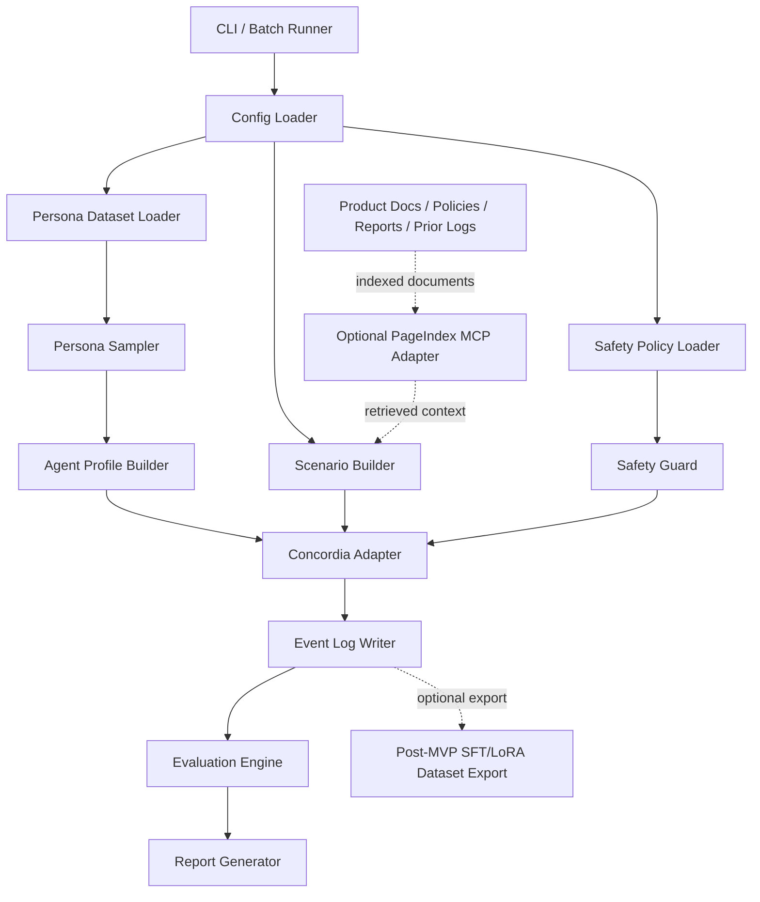

# Architecture

## System Context

Korean Social Simulation Lab sits between structured synthetic persona data, LLM-powered generative agents, optional document retrieval, and downstream evaluation/reporting.

External systems:

- Hugging Face Datasets: source for `nvidia/Nemotron-Personas-Korea`.
- Concordia: simulation engine for generative agent-based modeling.
- LLM provider: configurable text generation backend used by Concordia and optional evaluators.
- Text embedder: required if Concordia associative memory is enabled.
- PageIndex MCP: optional document grounding layer for vectorless reasoning-based retrieval.
- Local filesystem: configuration, generated logs, metrics, reports, and cached data.

The system must be built as a reproducible local-first pipeline. Network access is explicit and configurable.

## Architecture Diagram



## Module Responsibilities

### `config`

- Purpose: Load and validate YAML config plus environment overrides.
- Inputs: YAML paths, environment variables, CLI overrides.
- Outputs: typed runtime config object.
- Main responsibilities:
  - Validate required keys.
  - Resolve output paths.
  - Apply defaults.
  - Redact secrets for logs.
- Failure behavior: fail fast with `ConfigurationError` and field-level messages.
- Test strategy: unit tests for valid configs, missing keys, invalid types, secret redaction, and environment overrides.

### `data`

- Purpose: Provide access to persona datasets and local fixture data.
- Inputs: dataset name, split, cache directory, optional local parquet path.
- Outputs: iterable or table-like persona rows.
- Main responsibilities:
  - Load Hugging Face dataset or local parquet.
  - Support offline fixture mode.
  - Expose schema validation.
  - Avoid committing large raw data.
- Failure behavior: raise `DatasetLoadError` for missing datasets, unavailable cache, incompatible schema, or network failure.
- Test strategy: unit tests with small fixtures; integration test behind marker for actual HF dataset loading.

### `personas`

- Purpose: Sample and normalize synthetic personas.
- Inputs: raw persona rows, sampling constraints, random seed.
- Outputs: `PersonaRecord` and `PopulationSample` objects.
- Main responsibilities:
  - Validate fields.
  - Filter by region, age range, occupation, interests, and scenario needs.
  - Sample deterministically.
  - Attach sampling metadata.
- Failure behavior: raise `SamplingError` if filters produce too few rows or invalid constraints.
- Test strategy: deterministic fixture-based tests and edge cases for empty samples.

### `agents`

- Purpose: Convert personas into Concordia-ready agent profiles.
- Inputs: `PersonaRecord`, agent template, safety policy.
- Outputs: `AgentProfile` objects containing background, memory seeds, goals, constraints, and speech guidelines.
- Main responsibilities:
  - Map persona fields to agent background.
  - Create initial memory and goals.
  - Prevent unsafe profile labels or real-user inference.
  - Preserve Korean language behavior where configured.
- Failure behavior: raise `AgentProfileError` for missing required fields or unsafe labels.
- Test strategy: snapshot/golden tests for profile rendering and safety filtering.

### `scenarios`

- Purpose: Compile scenario templates into executable simulation plans.
- Inputs: scenario YAML, selected category, optional RAG context, safety policy.
- Outputs: `ScenarioSpec` and `SimulationPlan`.
- Main responsibilities:
  - Support scenario families:
    - product and price reaction
    - marketing and viral risk
    - rumor and crisis response
    - conflict and mediation
    - policy and notice acceptance
    - community operation
    - organization and negotiation
    - game NPC social worlds
  - Validate participant counts and episode length.
  - Define metrics to collect.
  - Declare non-goals and forbidden objectives.
- Failure behavior: raise `ScenarioValidationError` for unsafe or incomplete scenario specs.
- Test strategy: schema tests, golden compiled scenarios, safety rejection tests.

### `rag`

- Purpose: Optional document retrieval for grounding scenario facts.
- Inputs: query, document collection ID, PageIndex API key, MCP client config.
- Outputs: `RetrievedContext` with citation metadata.
- Main responsibilities:
  - Retrieve document sections.
  - Preserve page/section references where available.
  - Fail closed when required grounding is unavailable.
  - Allow no-RAG mode.
- Failure behavior: raise `RetrievalError` or return typed unavailable status depending on scenario config.
- Test strategy: mocked MCP tests, timeout tests, no-RAG tests, citation preservation tests.

### `simulation`

- Purpose: Orchestrate Concordia execution.
- Inputs: `SimulationPlan`, agent profiles, scenario spec, LLM config, embedder config.
- Outputs: event stream and final simulation result.
- Main responsibilities:
  - Build Concordia agents and Game Master.
  - Run deterministic turn loops when possible.
  - Collect observations, actions, GM decisions, and metrics hooks.
  - Enforce max turns and budget limits.
- Failure behavior: return `SimulationResult` with status `failed` or `partial`; persist partial logs if safe.
- Test strategy: dry-run adapter tests, mocked LLM tests, turn-limit tests, failure recovery tests.

### `safety`

- Purpose: Enforce safety policies before and during simulation.
- Inputs: scenario spec, agent profiles, generated content, metric requests.
- Outputs: allow/block decisions and audit notes.
- Main responsibilities:
  - Block political persuasion targeting, real-person profiling, protected-group exploitation, harassment, and fake influence operations.
  - Require aggregate-only reporting.
  - Add uncertainty notes.
  - Redact sensitive text from logs where configured.
- Failure behavior: raise `SafetyViolationError` before execution or stop a run with blocked status.
- Test strategy: adversarial scenario tests and policy regression tests.

### `evaluation`

- Purpose: Convert logs into metrics.
- Inputs: JSONL event logs, scenario metrics config.
- Outputs: typed metric results, CSV, and report sections.
- Main responsibilities:
  - Compute share intent, trust score, backlash, confusion, conflict intensity, consensus, conversion intent, dropout intent, and policy acceptance.
  - Separate synthetic observations from real validation.
  - Support deterministic rule-based metrics and optional LLM judges.
- Failure behavior: return partial metrics with explicit errors for unsupported metrics.
- Test strategy: unit tests over golden logs and deterministic metric fixtures.

### `storage`

- Purpose: Persist runs, logs, metrics, and reports.
- Inputs: events, run metadata, output directory.
- Outputs: JSONL, JSON, CSV, Markdown files.
- Main responsibilities:
  - Atomic writes where practical.
  - Stable file naming.
  - Metadata capture.
  - Prevent accidental overwrite unless configured.
- Failure behavior: raise `StorageError`; keep temporary files identifiable.
- Test strategy: tempdir tests for write/read, overwrite protection, invalid path handling.

### `reporting`

- Purpose: Produce human-readable outputs.
- Inputs: run metadata, metric outputs, safety notes, selected examples.
- Outputs: Markdown report and optional CSV summaries.
- Main responsibilities:
  - Summarize hypothesis results.
  - Include limitations and uncertainty.
  - Include safety notes.
  - Avoid unsupported claims.
- Failure behavior: emit report with partial sections and explicit missing data notes.
- Test strategy: golden markdown tests and lint checks.

## Data Flow

1. Load runtime config.
2. Load safety policy.
3. Load persona data from HF dataset, local parquet, or test fixture.
4. Validate dataset schema.
5. Filter and sample personas deterministically.
6. Convert personas into agent profiles.
7. Load scenario template and optional document-grounded context.
8. Run safety validation on scenario and profiles.
9. Build Concordia agents, Game Master, and scenario environment.
10. Execute turn loop.
11. Write events to JSONL.
12. Compute metrics.
13. Generate report.
14. Optionally export cleaned logs for later SFT/LoRA optimization.

## Control Flow

```txt
initialized
  -> config_loaded
  -> personas_loaded
  -> personas_sampled
  -> profiles_built
  -> scenario_compiled
  -> safety_validated
  -> simulation_running
  -> logs_written
  -> metrics_computed
  -> report_generated
  -> completed

failure branch:
  any_state -> failed
  simulation_running -> partial -> report_generated_with_limitations
```

## Error Handling Strategy

Use typed project errors:

- `ConfigurationError`
- `DatasetLoadError`
- `PersonaSchemaError`
- `SamplingError`
- `AgentProfileError`
- `ScenarioValidationError`
- `SafetyViolationError`
- `RetrievalError`
- `SimulationError`
- `StorageError`
- `EvaluationError`

Rules:

- Configuration, schema, and safety errors fail fast.
- Retrieval errors fail closed when scenario declares grounding as required.
- Retrieval errors degrade gracefully when scenario declares RAG as optional.
- Simulation errors preserve partial logs when safe.
- Reports must include known limitations.
- Logs must redact secrets and configured sensitive content.

## Configuration Strategy

Configuration sources, from lowest to highest precedence:

1. Built-in defaults.
2. YAML config file.
3. Environment variables.
4. CLI flags.

Configuration groups:

- `runtime`: output directory, seed, dry-run mode, max turns.
- `dataset`: dataset name, split, cache directory, local fixture path.
- `sampling`: filters, sample size, seed.
- `llm`: provider, model, temperature, max tokens, timeout, retry count.
- `embedder`: provider and model when associative memory is enabled.
- `rag`: enabled flag, provider, PageIndex MCP endpoint, collection ID, timeout.
- `scenario`: category, template, participant count, metrics.
- `safety`: prohibited objectives, redaction, report disclaimers.

Secrets must be read from environment variables or an ignored local `.env` file.

## Performance Considerations

Expected bottlenecks:

- Loading and filtering 1M-row persona datasets.
- LLM calls per agent turn.
- Optional PageIndex retrieval latency.
- Log volume for long simulations.
- Optional LLM-based evaluation.

Optimization boundaries:

- Use Polars/DuckDB or HF Datasets filtering for large persona sets.
- Cache sampled populations by run ID and seed.
- Use dry-run and mocked LLM modes for tests.
- Stream logs instead of holding full conversations in memory.
- Limit max turns, max participants, and max tokens.
- Fine-tuning is not allowed as an MVP dependency; it is a later optimization only.

## Security and Safety Considerations

- Do not store API keys in config committed to source control.
- Do not commit raw downloaded datasets or generated logs.
- Do not infer real user identity or political orientation.
- Do not create targeting outputs for real groups.
- Do not output tactical manipulation instructions.
- Require aggregate metrics and uncertainty disclaimers.
- Validate all YAML inputs.
- Treat MCP output as untrusted input.
- Redact secrets from logs and errors.
- Pin dependency versions once implementation starts.

## Extensibility

Add new components through stable interfaces:

- New persona datasets: implement a dataset adapter returning `PersonaRecord`-compatible rows.
- New scenario categories: add YAML schema, safety policy mapping, metrics list, and tests.
- New RAG providers: implement `DocumentRetriever` protocol.
- New LLM providers: implement `LLMClient` or Concordia-compatible wrapper.
- New metrics: implement `MetricEvaluator` and golden tests.
- New report formats: implement `ReportRenderer`.
