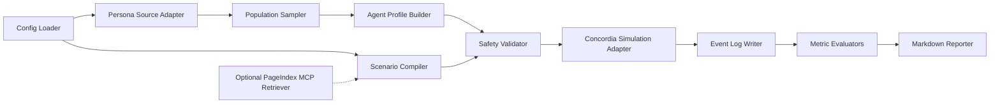

# Technical Design

## Overview

The MVP is a CLI-first Python pipeline. It does not train a model. It does not require RAG. It uses structured persona data to initialize agents, scenario configuration to define social context, Concordia to execute interactions, and deterministic evaluators to produce metrics and reports.

The primary implementation constraint is auditability: every input, sample, generated profile, scenario plan, event, metric, and report must be reproducible or explicitly marked nondeterministic.

## Architecture



## Components

### Config Loader

- Responsibility: Load YAML config, apply environment overrides, validate typed settings.
- Public interface:
  - `load_config(path: Path, overrides: CliOverrides | None) -> RuntimeConfig`
- Inputs: config path, CLI overrides, environment variables.
- Outputs: `RuntimeConfig`.
- Dependencies: Pydantic, YAML parser.
- Failure behavior: raises `ConfigurationError`.
- Test approach: valid config, missing config, environment override, secret redaction.

### Persona Source Adapter

- Responsibility: Load persona rows from local fixture, local parquet, or Hugging Face dataset.
- Public interface:
  - `load_personas(config: DatasetConfig) -> PersonaTable`
- Inputs: dataset config.
- Outputs: table-like persona collection.
- Dependencies: Hugging Face Datasets, Polars/DuckDB optional.
- Failure behavior: raises `DatasetLoadError` or `PersonaSchemaError`.
- Test approach: local fixture tests and optional live HF marker test.

### Population Sampler

- Responsibility: Apply filters and deterministic sampling.
- Public interface:
  - `sample_population(personas: PersonaTable, config: SamplingConfig) -> PopulationSample`
- Inputs: persona table, sampling config.
- Outputs: `PopulationSample`.
- Dependencies: random seed utility.
- Failure behavior: raises `SamplingError`.
- Test approach: same-seed determinism, insufficient rows, invalid filters.

### Agent Profile Builder

- Responsibility: Convert `PersonaRecord` objects into simulation-ready profiles.
- Public interface:
  - `build_agent_profiles(sample: PopulationSample, template: AgentTemplate) -> list[AgentProfile]`
- Inputs: population sample, agent template.
- Outputs: agent profiles.
- Dependencies: safety rules, prompt renderer.
- Failure behavior: raises `AgentProfileError` or `SafetyViolationError`.
- Test approach: golden profile snapshots and unsafe label rejection tests.

### Scenario Compiler

- Responsibility: Convert scenario config into a typed `SimulationPlan`.
- Public interface:
  - `compile_scenario(config: ScenarioConfig, context: RetrievedContext | None) -> SimulationPlan`
- Inputs: scenario config, optional retrieved context.
- Outputs: simulation plan.
- Dependencies: scenario registry, metric registry, safety policy.
- Failure behavior: raises `ScenarioValidationError`.
- Test approach: supported scenario families, missing metrics defaulting, unknown family rejection.

### Optional PageIndex MCP Retriever

- Responsibility: Retrieve document grounding when enabled.
- Public interface:
  - `retrieve_context(query: RetrievalQuery) -> RetrievedContext`
- Inputs: query, collection IDs, retrieval limits.
- Outputs: retrieved sections with references.
- Dependencies: MCP-compatible client or PageIndex SDK/API wrapper.
- Failure behavior: raises `RetrievalError` when required; returns unavailable note when optional.
- Test approach: mocked retrieval, timeout, required/optional behavior.

### Safety Validator

- Responsibility: Enforce allowed and disallowed use rules.
- Public interface:
  - `validate_safety(plan: SimulationPlan, profiles: list[AgentProfile], policy: SafetyPolicy) -> SafetyDecision`
- Inputs: plan, profiles, policy.
- Outputs: allow/block decision.
- Dependencies: policy pattern rules and optional classifier later.
- Failure behavior: raises `SafetyViolationError` on block.
- Test approach: adversarial scenarios and regression fixtures.

### Concordia Simulation Adapter

- Responsibility: Bridge project models to Concordia entities, components, Game Master, and simulation loop.
- Public interface:
  - `run_simulation(plan: SimulationPlan, profiles: list[AgentProfile], runtime: RuntimeConfig) -> SimulationResult`
- Inputs: plan, profiles, runtime config.
- Outputs: event stream and result object.
- Dependencies: Concordia, LLM provider adapter, embedder adapter.
- Failure behavior: returns partial/failed result with typed errors; preserves safe partial logs.
- Test approach: dry-run, mock LLM, max turn enforcement, failed LLM call.

### Event Log Writer

- Responsibility: Write event logs and run metadata.
- Public interface:
  - `write_event(event: SimulationEvent) -> None`
  - `finalize_run(result: SimulationResult) -> RunArtifacts`
- Inputs: event stream, run metadata.
- Outputs: JSONL and JSON files.
- Dependencies: filesystem.
- Failure behavior: raises `StorageError`.
- Test approach: tempdir writes, overwrite protection, JSON schema validation.

### Metric Evaluators

- Responsibility: Compute scenario metrics from event logs.
- Public interface:
  - `evaluate_run(events: Iterable[SimulationEvent], config: MetricsConfig) -> MetricsResult`
- Inputs: events, metric config.
- Outputs: metrics JSON/CSV.
- Dependencies: metric registry.
- Failure behavior: unavailable metric entry, not full crash.
- Test approach: golden logs and expected metric values.

### Report Generator

- Responsibility: Create markdown reports.
- Public interface:
  - `render_report(run: RunArtifacts, metrics: MetricsResult) -> str`
- Inputs: run metadata, sample summary, metrics, examples, safety notes.
- Outputs: markdown text.
- Dependencies: Jinja or simple renderer.
- Failure behavior: partial report with missing sections noted.
- Test approach: golden report snapshots.

## Data Models

Language-neutral typed pseudocode:

```python
class RuntimeConfig:
    run_id: str
    seed: int
    dry_run: bool
    output_dir: str
    max_turns: int
    max_participants: int
    dataset: DatasetConfig
    sampling: SamplingConfig
    scenario: ScenarioConfig
    llm: LLMConfig
    embedder: EmbedderConfig | None
    rag: RAGConfig
    safety: SafetyPolicy
```

```python
class PersonaRecord:
    uuid: str
    persona: str
    professional_persona: str | None
    family_persona: str | None
    cultural_background: str | None
    skills_and_expertise: str | None
    hobbies_and_interests: str | None
    age: int
    sex: str | None
    occupation: str
    district: str
    province: str
    country: str
    metadata: dict[str, str | int | float | bool | None]
```

```python
class PopulationSample:
    sample_id: str
    seed: int
    filters: dict[str, object]
    records: list[PersonaRecord]
    source: str
    created_at: str
```

```python
class AgentProfile:
    agent_id: str
    persona_uuid: str
    display_name: str
    language: str
    background: str
    memory_seeds: list[str]
    goals: list[str]
    behavior_rules: list[str]
    safety_notes: list[str]
```

```python
class ScenarioSpec:
    scenario_id: str
    family: str
    title: str
    hypothesis: str
    allowed_objective: str
    participant_count: int
    max_turns: int
    interventions: list[ScenarioIntervention]
    metrics: list[str]
    rag_queries: list[str]
```

```python
class RetrievedContext:
    provider: str
    status: Literal['available', 'unavailable', 'skipped']
    query: str
    sections: list[RetrievedSection]
    warnings: list[str]
```

```python
class SimulationEvent:
    run_id: str
    turn: int
    event_type: Literal['observation', 'agent_action', 'gm_decision', 'metric_hook', 'safety_block', 'system']
    actor_id: str | None
    timestamp: str
    payload: dict[str, object]
```

```python
class SimulationResult:
    run_id: str
    status: Literal['success', 'partial', 'failed', 'blocked']
    events_path: str | None
    metrics_path: str | None
    report_path: str | None
    errors: list[str]
    warnings: list[str]
```

## Interfaces

### CLI

```bash
kssim --help
kssim validate-config --config <path>
kssim sample --config <path> --output <path>
kssim compile-scenario --config <path> --output <path>
kssim run --config <path> [--dry-run]
kssim evaluate --events <events.jsonl> --config <path>
kssim report --input <run-dir> --output <report.md>
```

### Scenario YAML Shape

```yaml
scenario:
  id: product_reaction_v1
  family: product_reaction
  title: AI file organizer product reaction
  hypothesis: Privacy-forward messaging reduces backlash.
  language: ko
  participant_count: 20
  max_turns: 5
  interventions:
    - id: message_a
      description: Productivity-centered message
    - id: message_b
      description: Privacy-centered message
  metrics:
    - trust_score
    - confusion_rate
    - backlash_rate
    - conversion_intent
rag:
  enabled: false
  required: false
```

## Algorithms

### Persona Sampling Algorithm

1. Load persona table.
2. Validate required schema.
3. Apply filters in deterministic order:
   - country
   - province/district
   - age range
   - occupation
   - interest keywords
   - family/housing/education filters if configured
4. Count matched rows.
5. If count is below requested size and smaller samples are not allowed, fail.
6. Create seeded random generator.
7. Select rows deterministically.
8. Sort or preserve selected deterministic order according to config.
9. Write sample metadata.

### Agent Profile Construction Algorithm

1. Start from base behavior template.
2. Insert demographic and persona text fields.
3. Add scenario-specific role instructions.
4. Add language and realism rules.
5. Add safety constraints:
   - synthetic persona reminder
   - no real-person claims
   - no political persuasion targeting
6. Validate profile length and required fields.
7. Emit `AgentProfile`.

### Scenario Compilation Algorithm

1. Load scenario YAML.
2. Validate family against registry.
3. Apply default metrics for family.
4. Retrieve optional RAG context if enabled.
5. Add retrieved context to scenario facts with provenance.
6. Validate participant count and turn budget.
7. Run safety policy checks.
8. Emit `SimulationPlan`.

### Simulation Execution Algorithm

1. Create run directory.
2. Write run metadata.
3. Convert profiles into Concordia-compatible entities.
4. Build Game Master from scenario plan.
5. For each turn until max turns:
   - Provide observations to agents.
   - Collect agent actions or dry-run placeholders.
   - Ask Game Master to resolve actions.
   - Emit events.
   - Run metric hooks.
   - Run safety guard if configured.
6. Finalize result.
7. Compute metrics.
8. Generate report.

## State Flow

```txt
initialized
  -> validating_config
  -> loading_personas
  -> sampling_population
  -> building_profiles
  -> compiling_scenario
  -> retrieving_context_optional
  -> validating_safety
  -> running_simulation
  -> writing_logs
  -> evaluating_metrics
  -> generating_report
  -> completed

blocked path:
  validating_safety -> blocked

partial path:
  running_simulation -> partial -> evaluating_metrics -> generating_report

failure path:
  any step -> failed
```

## Configuration

Required config keys:

- `runtime.run_id`
- `runtime.seed`
- `runtime.output_dir`
- `runtime.max_turns`
- `dataset.mode`
- `sampling.sample_size`
- `scenario.id`
- `scenario.family`
- `scenario.participant_count`
- `safety.policy_version`

Environment variables:

- `KSSIM_LLM_PROVIDER`
- `KSSIM_LLM_MODEL`
- `KSSIM_LLM_API_KEY`
- `KSSIM_PAGEINDEX_API_KEY`
- `KSSIM_HF_CACHE_DIR`
- `KSSIM_OUTPUT_DIR`

Defaults:

- `dry_run`: `true` for examples.
- `rag.enabled`: `false`.
- `rag.required`: `false`.
- `language`: `ko`.
- `max_turns`: 5.
- `max_participants`: 50.

## Storage

Output layout:

```txt
outputs/<scenario_id>/<run_id>/
├── run_metadata.json
├── config_resolved.redacted.json
├── sampled_personas.jsonl
├── agent_profiles.jsonl
├── scenario_plan.json
├── retrieved_context.json
├── events.jsonl
├── metrics.json
├── metrics.csv
└── report.md
```

Rules:

- Do not overwrite existing run directories unless `runtime.overwrite=true`.
- Write JSONL one event per line.
- Include schema version in all JSON files.
- Use UTF-8.

## Error Handling

Expected errors:

- `ConfigurationError`: invalid config or missing secrets.
- `DatasetLoadError`: failed dataset source.
- `PersonaSchemaError`: invalid persona row.
- `SamplingError`: invalid or insufficient sample.
- `AgentProfileError`: profile construction failed.
- `ScenarioValidationError`: invalid scenario.
- `SafetyViolationError`: prohibited objective or unsafe profile.
- `RetrievalError`: required RAG failed.
- `SimulationError`: Concordia/LLM execution failed.
- `StorageError`: output writing failed.
- `EvaluationError`: metrics failed.

Recovery:

- Safety errors block execution.
- Required RAG errors block execution.
- Optional RAG errors continue with warning.
- Simulation errors produce partial runs when safe.
- Evaluation errors produce partial metrics.

## Logging and Observability

Minimum run metadata:

- run ID
- scenario ID
- git commit if available
- config hash
- safety policy version
- random seed
- dataset source
- sample size
- max turns
- RAG enabled/disabled
- dry-run or live mode

Metrics:

- events count
- turns completed
- participant count
- LLM calls if live
- RAG calls if enabled
- blocked safety checks
- unavailable metrics

## Testing Design

- Unit tests for pure validation and transformation.
- Integration tests with fixture personas and mock LLM.
- Smoke tests for CLI commands.
- Golden tests for profiles, scenario plans, metrics, and reports.
- Safety regression tests for prohibited scenarios.
- Live tests marked separately: `@pytest.mark.live_hf`, `@pytest.mark.live_llm`, `@pytest.mark.live_pageindex`.

## Non-Goals

- No production web UI.
- No fine-tuning training loop.
- No real-world prediction claims.
- No real user profiling.
- No political persuasion optimization.
- No hidden scraping.
- No mandatory PageIndex or vector database.
- No database server.

## Open Questions

- Which LLM provider will be used first? Assumption: provider adapter will be configurable and mocked by default.
- Which Concordia prefab will be most suitable? Assumption: initial adapter will use the simplest available agent/GM pattern and isolate Concordia-specific details.
- Will reports require Korean or English? Assumption: simulation content defaults to Korean, documentation and developer outputs default to English.
- Will PageIndex be self-hosted or cloud? Assumption: optional MCP/API configuration supports either through adapter settings.
