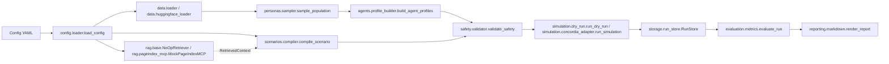

# Architecture

Korean Social Simulation Lab's MVP is implemented as a local-first pipeline under `src/korean_social_simulator/`. The current codebase separates configuration, persona ingestion, deterministic sampling, agent profile building, scenario compilation, safety validation, simulation execution, storage, evaluation, and reporting into explicit modules.

## Module Layout

```text
src/korean_social_simulator/
├── __init__.py
├── cli.py
├── config/
│   ├── __init__.py
│   ├── loader.py
│   └── models.py
├── data/
│   ├── __init__.py
│   ├── huggingface_loader.py
│   └── loader.py
├── personas/
│   ├── __init__.py
│   └── sampler.py
├── agents/
│   ├── __init__.py
│   └── profile_builder.py
├── scenarios/
│   ├── __init__.py
│   ├── compiler.py
│   └── registry.py
├── safety/
│   ├── __init__.py
│   └── validator.py
├── rag/
│   ├── __init__.py
│   ├── base.py
│   ├── noop.py
│   └── pageindex_mcp.py
├── simulation/
│   ├── __init__.py
│   ├── concordia_adapter.py
│   └── dry_run.py
├── storage/
│   ├── __init__.py
│   └── run_store.py
├── evaluation/
│   ├── __init__.py
│   └── metrics.py
├── reporting/
│   ├── __init__.py
│   └── markdown.py
├── errors.py
└── models.py
```

## Pipeline Flow



## Modules and Public API

### 1. `cli.py`

- Typer CLI root app: `app`
- Six commands: `validate_config()`, `sample()`, `compile_scenario()`, `run()`, `evaluate()`, and `report()`
- Console entrypoint: `main()`

### 2. `config/models.py` and `config/loader.py`

- `config.models` Pydantic models:
  - `AgeRangeFilter`
  - `SamplingFilters`
  - `DatasetConfig`
  - `SamplingConfig`
  - `LLMConfig`
  - `EmbedderConfig`
  - `RAGConfig`
  - `ScenarioIntervention`
  - `ScenarioConfig`
  - `SafetyPolicy`
  - `RuntimeSection`
  - `RuntimeConfig`
- `config.loader` public functions:
  - `load_config(path) -> RuntimeConfig`
  - `redact_config(config) -> dict[str, object]`
- Behavior: YAML parsing, Pydantic validation, business-rule validation, and environment overrides for `KSSIM_LLM_API_KEY`, `KSSIM_PAGEINDEX_API_KEY`, `KSSIM_OUTPUT_DIR`, and `KSSIM_HF_CACHE_DIR`

### 3. `models.py`

- Core data models:
  - `PersonaRecord`
  - `PopulationSample`
  - `AgentProfile`
  - `ScenarioIntervention`
  - `ScenarioSpec`
  - `SimulationPlan`
  - `RetrievedSection`
  - `RetrievedContext`
  - `SimulationEvent`
  - `SimulationResult`
  - `MetricsResult`
  - `SafetyDecision`
- Type aliases:
  - `EventType`
  - `RunStatus`

### 4. `errors.py`

- Shared base exception: `KoreanSocialSimulationError`
- Eleven typed error subclasses:
  - `ConfigurationError`
  - `DatasetLoadError`
  - `PersonaSchemaError`
  - `SamplingError`
  - `AgentProfileError`
  - `ScenarioValidationError`
  - `SafetyViolationError`
  - `RetrievalError`
  - `SimulationError`
  - `StorageError`
  - `EvaluationError`

### 5. `data/loader.py` and `data/huggingface_loader.py`

- `load_personas_fixture(path) -> list[PersonaRecord]`
- `load_personas_hf(dataset_name="nvidia/Nemotron-Personas-Korea", split="train", cache_dir=None, max_rows=None) -> list[PersonaRecord]`
- Covers offline fixture loading and optional Hugging Face dataset loading

### 6. `personas/sampler.py`

- `sample_population(personas, config) -> PopulationSample`
- Applies deterministic filtering and seeded sampling

### 7. `agents/profile_builder.py`

- `build_agent_profiles(sample, language="ko", safety_policy=None) -> list[AgentProfile]`
- Renders Korean-language background text, memory seeds, goals, behavior rules, and profile safety notes

### 8. `scenarios/registry.py` and `scenarios/compiler.py`

- `scenarios.registry` public API:
  - `SUPPORTED_FAMILIES`
  - `FAMILY_DEFAULT_METRICS`
  - `is_supported_family(family) -> bool`
  - `get_default_metrics(family) -> list[str]`
  - `list_supported_families() -> list[str]`
- Supported scenario families:
  - `product_reaction`
  - `pricing_reaction`
  - `viral_marketing_risk`
  - `rumor_crisis_response`
  - `conflict_mediation`
  - `policy_notice_acceptance`
  - `community_operation`
  - `organization_negotiation`
  - `game_npc_social_world`
- `scenarios.compiler` public API:
  - `compile_scenario(config, context=None, run_id="run_default", plan_id="plan_default") -> SimulationPlan`

### 9. `safety/validator.py`

- `validate_safety(plan, profiles, policy) -> SafetyDecision`
- Blocks prohibited political persuasion, real-person profiling, protected-group targeting, fake influence, harassment, and social-engineering patterns

### 10. `rag/base.py` and `rag/pageindex_mcp.py`

- `NoOpRetriever.retrieve(query) -> RetrievedContext`
- `MockPageIndexMCP.retrieve(query, required=False) -> RetrievedContext`
- Provides the MVP no-op retriever path and a mock PageIndex MCP adapter for offline testing

### 11. `simulation/dry_run.py` and `simulation/concordia_adapter.py`

- `run_dry_run(plan, profiles) -> list[SimulationEvent]`
- `run_simulation(plan, profiles) -> SimulationResult`
- `run_dry_run()` emits deterministic placeholder turn events without LLM calls
- `run_simulation()` is the Concordia boundary adapter and returns a partial result when Concordia is unavailable

### 12. `storage/run_store.py`

- Class: `RunStore(run_dir, overwrite=False)`
- Public methods:
  - `write_event(event)`
  - `write_events_batch(events)`
  - `write_metadata(metadata)`
  - `finalize(result) -> SimulationResult`
- Manages stable run artifacts including `events.jsonl`, `run_metadata.json`, `metrics.json`, and `report.md`

### 13. `evaluation/metrics.py`

- `evaluate_run(events, metric_names) -> MetricsResult`
- Evaluates deterministic MVP metrics including `event_count`, `turn_count`, `agent_count`, `trust_score`, `confusion_rate`, `backlash_rate`, and `conversion_intent`

### 14. `reporting/markdown.py`

- `render_report(run_id, status, metrics, events, scenario_title="", scenario_hypothesis="", safety_notes=None, errors=None, warnings=None) -> str`
- Produces the markdown report used for run summaries, sample events, limitations, and follow-up validation notes
