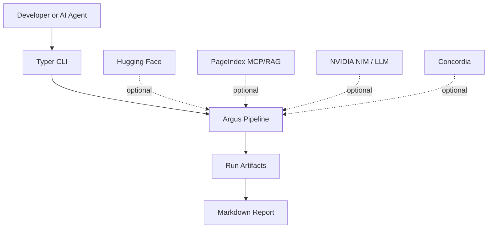
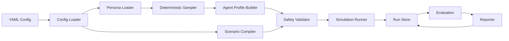

# Architecture

## System Context

Argus sits between synthetic persona sources and auditable experiment artifacts. It should support a deterministic offline MVP first, then optional live adapters.


```mermaid
flowchart TD
    User[Developer or AI Agent] --> CLI[Typer CLI]
    CLI --> Pipeline[Argus Pipeline]
    Pipeline --> Artifacts[Run Artifacts]
    Artifacts --> Report[Markdown Report]
    HF[Hugging Face] -. optional .-> Pipeline
    RAG[PageIndex MCP/RAG] -. optional .-> Pipeline
    LLM[NVIDIA NIM / LLM] -. optional .-> Pipeline
    Concordia[Concordia] -. optional .-> Pipeline
```

## Target Pipeline


```mermaid
flowchart LR
    Config[YAML Config] --> LoadConfig[Config Loader]
    LoadConfig --> PersonaLoader[Persona Loader]
    PersonaLoader --> Sampler[Deterministic Sampler]
    Sampler --> ProfileBuilder[Agent Profile Builder]
    LoadConfig --> ScenarioCompiler[Scenario Compiler]
    ProfileBuilder --> Safety[Safety Validator]
    ScenarioCompiler --> Safety
    Safety --> Runner[Simulation Runner]
    Runner --> Store[Run Store]
    Store --> Eval[Evaluation]
    Eval --> Reporter[Reporter]
    Reporter --> Store
```

## Module Responsibilities

| Module | Purpose | Inputs | Outputs | Failure Behavior | Test Strategy |
|---|---|---|---|---|---|
| `cli.py` | User-facing commands | CLI args | messages, artifacts | typed error -> non-zero exit | CLI integration |
| `config.loader` | YAML/env loading | config path, env | `RuntimeConfig` | `ConfigurationError` | unit |
| `data.loader` | fixture loading | JSONL path | `PersonaRecord` list | `DatasetLoadError`, `PersonaSchemaError` | unit |
| `data.huggingface_loader` | optional HF loading | dataset name/split | `PersonaRecord` list | `DatasetLoadError` | mocked + marked live |
| `personas.sampler` | deterministic selection | personas, filters | `PopulationSample` | `SamplingError` | unit |
| `agents.profile_builder` | profile generation | sample, safety policy | `AgentProfile` list | `AgentProfileError`, `SafetyViolationError` | unit |
| `scenarios.registry` | scenario family registry | family name | support/default metrics | unsupported -> compiler error | unit |
| `scenarios.compiler` | plan creation | scenario config | `SimulationPlan` | `ScenarioValidationError` | unit |
| `rag.pageindex_mcp` | mock retrieval | query, required flag | `RetrievedContext` | `RetrievalError` if required | unit |
| `safety.validator` | block unsafe uses | plan, profiles | `SafetyDecision` | `SafetyViolationError` | unit |
| `simulation.dry_run` | offline events | plan, profiles | `SimulationEvent` list | invalid plan error | unit |
| `simulation.*adapter` | optional live runs | plan, profiles, credentials | events + status | partial/failed status | mocked |
| `storage.run_store` | artifact persistence | events, metrics, report | files | `StorageError` | unit + integration |
| `evaluation.metrics` | metrics | events, metric names | `MetricsResult` | unavailable metrics recorded | unit |
| `reporting.markdown` | report rendering | metrics, events | Markdown | pure renderer | golden |

## Data Flow

1. Load YAML config.
2. Apply safe environment overrides.
3. Load personas from fixture or optional HF.
4. Filter and sample with seed.
5. Build agent profiles.
6. Compile supported scenario family.
7. Attach optional retrieved context when adapter code provides it; the stable CLI path skips live RAG.
8. Validate safety.
9. Run dry-run or optional live adapter.
10. Write events.
11. Evaluate metrics.
12. Write metrics.
13. Render report.
14. Finalize metadata.

## Control Flow

```txt
initialized
 -> config_loaded
 -> personas_loaded
 -> sampled
 -> profiles_built
 -> scenario_compiled
 -> safety_validated
 -> simulation_completed
 -> artifacts_written
 -> metrics_written
 -> report_written
 -> finalized
```

Failure states:

- `failed`: runtime or validation failure.
- `blocked`: safety policy rejection.
- `partial`: optional adapter unavailable or failed after partial progress.

## Error Handling Strategy

Use typed exceptions:

- `ConfigurationError`
- `DatasetLoadError`
- `PersonaSchemaError`
- `SamplingError`
- `AgentProfileError`
- `ScenarioValidationError`
- `SafetyViolationError`
- `RetrievalError`
- `SimulationError`
- `StorageError`
- `EvaluationError`

CLI must catch known project errors, print concise messages, and avoid secrets and stack traces by default.

## Configuration Strategy

Rules:

- YAML is canonical.
- `extra="forbid"` should stay enabled.
- Environment overrides must map to declared fields.
- Dry-run mode requires no secrets.
- Live mode requires the selected backend credential.
- `sampling.sample_size <= runtime.max_participants`.
- `scenario.participant_count <= runtime.max_participants`.
- `scenario.max_turns <= runtime.max_turns`.

## Artifact Strategy

Target output tree:

```txt
outputs/<run_id>/
  run_metadata.json
  sample.json
  profiles.json
  plan.json
  events.jsonl
  metrics.json
  metrics.csv
  report.md
```

`events.jsonl` must contain one valid JSON object per line.

## Performance Considerations

- Default examples must stay small.
- Fixture mode must be fast and offline.
- HF loading can be slow and belongs to optional tests.
- Live LLM calls must not run in normal offline CI.
- Reports should show event samples, not full logs.

## Security and Safety Considerations

Argus must block or avoid:

- political persuasion,
- voter targeting,
- protected-group targeting,
- real-person profiling,
- identity inference,
- harassment automation,
- social engineering,
- covert influence,
- fake grassroots manipulation.

Reports must state that outputs are synthetic and non-predictive.

## Extensibility

Add new behavior through explicit interfaces:

- new persona source -> loader + config + tests,
- new scenario family -> registry + default metrics + tests,
- new metric -> evaluator + report tests,
- new RAG backend -> provider + optional dependency + tests,
- new simulation backend -> adapter + mocked tests + marked live tests.
