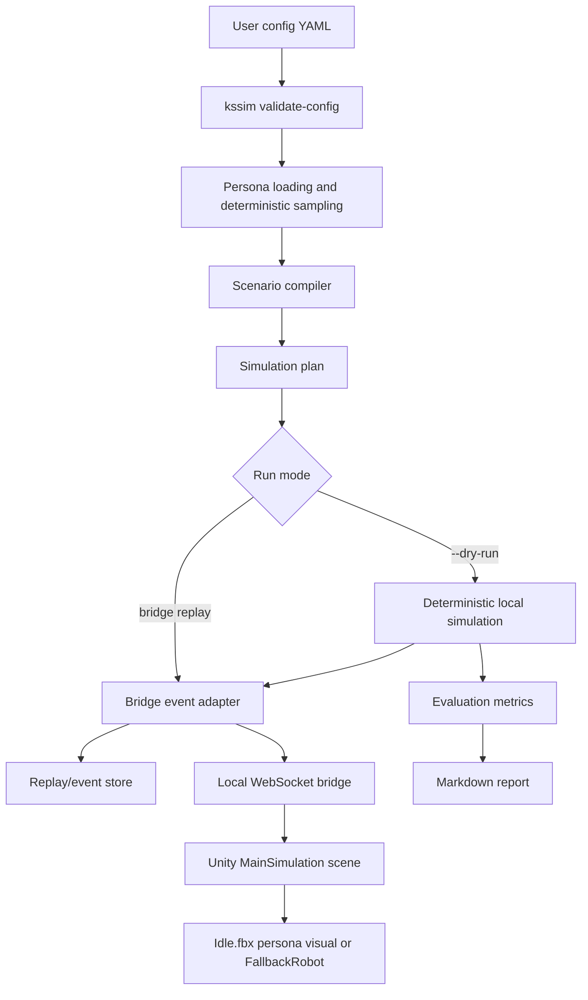
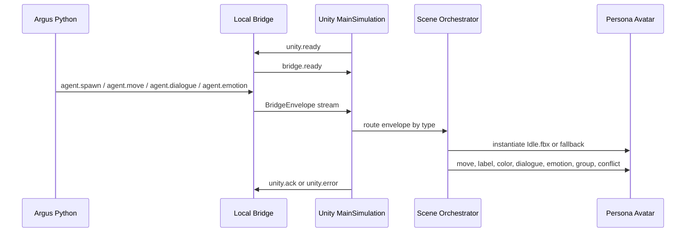
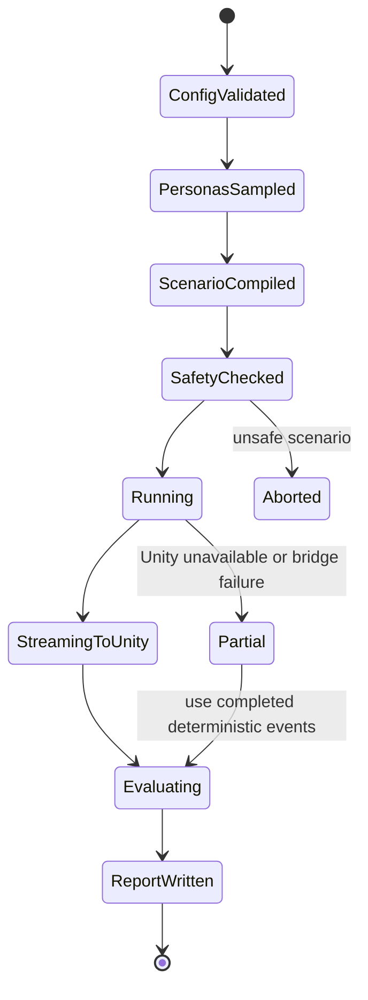

# Persona Evaluation Arena Implementation Plan

## Goal

Use the supplied Persona Evaluation Arena documentation as a handoff for extending Argus with a Unity-visible persona simulation that remains offline-first, safety bounded, and compatible with the existing `kssim` pipeline.

## Source Documents Reviewed

- `/Users/guribbong/Downloads/unity_persona_evaluation_docs.zip`
- `unity_persona_evaluation_docs/README.md`
- `unity_persona_evaluation_docs/IMPLEMENTATION_PROMPT.md`
- `unity_persona_evaluation_docs/specs/repository-stabilization/requirements.md`
- `unity_persona_evaluation_docs/specs/repository-stabilization/design.md`
- Current repository files under `/Users/guribbong/code/Argus`

The zip describes a Persona Evaluation Arena with persona sampling, scenario compilation, Unity/ML-Agents simulation, RL policy support, metrics, reporting, and safety enforcement. In this repo, the implemented surface is already closer to an event-stream Unity bridge than the zip's proposed ML-Agents-first architecture, so this plan treats the zip as a directional handoff rather than ground truth.

## Extracted Requirements

- Keep `kssim` as the primary entrypoint for validation, sampling, scenario compilation, simulation, evaluation, and reporting.
- Reuse Argus persona sampling and Pydantic v2 models as the schema boundary.
- Keep deterministic dry-run simulation available without network, Unity, LLM, Hugging Face, or external physics services.
- Stream public simulation events into Unity without exposing hidden persona prompts, memory seeds, private setup, or raw unsafe content.
- Render synthetic personas in a Unity scene and let them move, speak, show emotion, join groups, and show conflict state.
- Use the provided `Idle.fbx` model as the default Unity visual when available, with `FallbackRobot` as the local fallback.
- Remove MuJoCo as an active runtime component and keep deterministic local physics/conflict fallback behavior.
- Maintain safety restrictions against political persuasion, real-person profiling, manipulation, harassment, and sensitive personal data exposure.
- Validate with offline Python checks and Unity batch-mode import/smoke checks when the editor is available.

## Current Repo Mapping

| Requirement | Current / Target Files |
| --- | --- |
| CLI and offline pipeline | `src/korean_social_simulator/cli.py`, `src/korean_social_simulator/pipeline.py`, `examples/run_product_reaction.yaml` |
| Bridge schema and WebSocket surface | `src/korean_social_simulator/bridge_schema/`, `src/korean_social_simulator/bridge/` |
| Unity runtime scene | `unity/EmbodiedDebate/Assets/Project/Scenes/MainSimulation.unity` |
| Unity bridge and runtime scripts | `unity/EmbodiedDebate/Assets/Project/Scripts/Bridge/`, `unity/EmbodiedDebate/Assets/Project/Scripts/Runtime/`, `unity/EmbodiedDebate/Assets/Project/Scripts/Scene/` |
| Unity persona visuals | `unity/EmbodiedDebate/Assets/Project/Scripts/Robots/`, `unity/EmbodiedDebate/Assets/Project/Resources/`, `unity/EmbodiedDebate/Assets/Project/Resources/UserModels/Idle.fbx` |
| Safety policy | `src/korean_social_simulator/safety/`, `configs/safety.example.yaml` |
| Tests | `tests/unit/`, `tests/integration/bridge/`, `unity/EmbodiedDebate/Assets/Tests/` |

## Process Flow



## Unity Runtime Flow



## State Transitions



## Implementation Plan

1. Import the supplied FBX as a local Unity resource at `Assets/Project/Resources/UserModels/Idle.fbx`.
2. Make `SimulationBootstrap` prefer `Resources/UserModels/Idle` and fall back to `Resources/FallbackRobot`.
3. Keep demo mode and bridge mode behavior unchanged except for the selected visual model.
4. Remove MuJoCo runtime code paths and docs through a separate subagent-owned patch.
5. Update docs to describe the active architecture as Argus + local bridge + Unity visualization + deterministic fallback behavior.
6. Run Python checks for changed bridge/config behavior and Unity batch-mode import/smoke validation.

## Acceptance Criteria

- `Idle.fbx` exists under the Unity project and Unity generates import metadata for it.
- `SimulationBootstrap` logs that it loaded `Resources/UserModels/Idle` when the model is available.
- `MainSimulation.unity` can run in demo mode and produce the smoke screenshot.
- Offline Python tests covering the bridge and dry-run path pass.
- MuJoCo is no longer required, advertised, or tested as an active runtime backend.
- Safety and privacy constraints are preserved: Unity receives only public display/event fields.

## Validation Commands

```bash
uv run ruff format .
uv run ruff check . --fix
uv run mypy src
uv run pytest -m "not live_hf and not live_llm and not integration and not live_pageindex"
"/Applications/Unity/Hub/Editor/2022.3.0f1/Unity.app/Contents/MacOS/Unity" -batchmode -quit -projectPath unity/EmbodiedDebate -logFile tmp/unity-import.log
"/Applications/Unity/Hub/Editor/2022.3.0f1/Unity.app/Contents/MacOS/Unity" -batchmode -projectPath unity/EmbodiedDebate -executeMethod ArgusUnity.Editor.BridgePlayModeSmoke.CaptureAndQuit -logFile tmp/unity-smoke.log
```

## Failure Behavior

- If Unity is unavailable, the Python dry-run path remains the supported fallback.
- If the FBX import fails, Unity must continue to use `FallbackRobot`.
- If the bridge disconnects, Unity should keep the local scene stable and Python should preserve replay artifacts already written.
- If unsafe scenario content is detected, compilation or runtime should abort with a structured safety error.

## Privacy And Security

- Do not stream hidden persona background, goals, memory seeds, raw prompts, API keys, or private datasets into Unity.
- Bind local bridge services to localhost by default.
- Do not require external services for tests or deterministic dry-runs.
- Treat user-supplied model assets as local inputs unless redistribution rights are explicitly confirmed before committing or publishing.

## Open Questions

- Should `Idle.fbx` become the committed default avatar asset, or remain a local user-provided project resource?
- Should future Unity work use ML-Agents training, or keep the current bridge-first visualization architecture until there is a concrete RL requirement?
- Should consensus detection be computed in Python from events or emitted by Unity as an observer signal?
