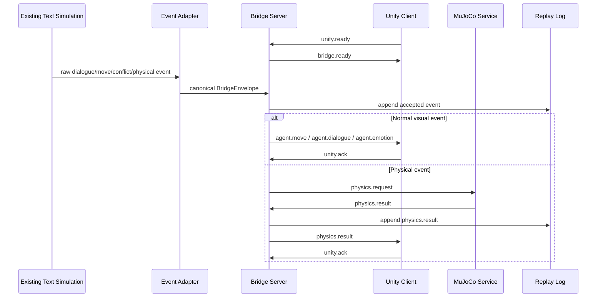

# Design: Unity Bridge with Deterministic Physics

> **DEPRECATED:** MuJoCo integration has been removed. Deterministic local fallback is now the sole physics backend. This document is preserved for historical context.

## Overview

This feature adds a communication and embodiment layer around an existing text-based population simulation. The text simulation remains authoritative and emits raw events. A Python bridge normalizes those events into versioned messages. Unity consumes the messages and visualizes agents as cute biped robot avatars. MuJoCo evaluates selected physical interactions and returns high-level outcomes for Unity to display.

Argus integration note: the current repository is packaged under `src/korean_social_simulator/`, and the current source event contract is documented in `docs/existing-text-simulation-analysis.md`. Bridge implementation paths in this spec use Argus-native modules rather than standalone `src/bridge` roots.

The MVP must be event-driven, deterministic under replay, local-first, and testable without requiring paid assets.

## Architecture



## Components

### Component: Simulation Event Adapter

**Responsibility:** Convert existing text simulation events into bridge schema messages.

**Public interface:**

```python
normalize_event(raw_event, session_context) -> BridgeEnvelope
```

**Inputs:**

- Raw text simulation event.
- Session ID.
- Simulation tick/time.
- Sequence allocator.

**Outputs:**

- Validated `BridgeEnvelope`.

**Dependencies:**

- Existing text simulation event structures.
- Schema validator.
- Sequence generator.

**Failure behavior:**

- Raises or returns `AdapterError`.
- Does not produce a Unity-facing message for invalid events.

**Test approach:**

- Unit tests for every raw event type.
- Golden fixture tests.

### Component: Bridge Server

**Responsibility:** Serve local WebSocket clients, route messages, coordinate physics, and write replay logs.

**Public interface:**

```txt
GET  /health
GET  /schema/version
WS   /ws/unity
POST /scenario/load
POST /simulation/start
POST /simulation/pause
POST /simulation/step
POST /replay/load
```

**Inputs:**

- Canonical simulation events.
- Unity control messages.
- MuJoCo physical results.
- Config files.

**Outputs:**

- Unity event stream.
- Physics requests.
- Replay logs.
- Structured errors.

**Dependencies:**

- WebSocket framework.
- Schema models.
- Replay store.
- MuJoCo client.

**Failure behavior:**

- Reject invalid messages.
- Pause on unrecoverable replay write errors.
- Fall back when MuJoCo is unavailable if configured.

**Test approach:**

- WebSocket lifecycle integration tests.
- Invalid payload tests.
- Reconnect tests.
- Replay tests.

### Component: Unity WebSocket Client

**Responsibility:** Maintain connection to the bridge and dispatch messages to Unity systems.

**Public interface:**

```csharp
IUnityBridgeClient.Connect()
IUnityBridgeClient.Disconnect()
IUnityBridgeClient.SendEnvelope(envelope)
IUnityBridgeClient.OnEnvelopeReceived
```

**Inputs:**

- WebSocket URL.
- Bridge messages.
- Unity lifecycle events.

**Outputs:**

- Unity ACK messages.
- Unity error messages.
- Parsed event callbacks.

**Dependencies:**

- Unity WebSocket package.
- JSON serializer.
- Main-thread dispatch queue.

**Failure behavior:**

- Reconnect with backoff.
- Queue or reject outbound messages when disconnected.
- Never block the main thread.

**Test approach:**

- EditMode parsing tests.
- PlayMode fake server tests.

### Component: Scene Orchestrator

**Responsibility:** Translate bridge events into Unity scene changes.

**Public interface:**

```csharp
ApplyEnvelope(BridgeEnvelope envelope)
SpawnOrUpdateAgent(AgentState state)
ApplyMovement(AgentMoveEvent evt)
ApplyDialogue(AgentDialogueEvent evt)
ApplyEmotion(AgentEmotionEvent evt)
ApplyPhysicsResult(PhysicsResult result)
```

**Inputs:**

- Valid bridge messages.

**Outputs:**

- Instantiated robot avatars.
- Transform changes.
- UI changes.
- Animator transitions.

**Dependencies:**

- Robot Avatar Manager.
- Dialogue UI Manager.
- Emotion UI Manager.
- Timeline/Replay UI.

**Failure behavior:**

- Unknown agent may trigger lazy spawn.
- Missing animation state falls back to idle.
- Invalid transforms are rejected or clamped.

**Test approach:**

- PlayMode tests for each event type.
- Manual scene review checklist.

### Component: Robot Avatar Manager

**Responsibility:** Manage robot asset instances.

**Public interface:**

```csharp
GetOrCreateAvatar(agentId)
SetGroupVisual(agentId, groupId)
SetEmotion(agentId, emotion, intensity)
SetActionState(agentId, actionState)
SetTransform(agentId, position, rotation)
```

**Inputs:**

- Agent IDs.
- Visual identity data.
- Animation states.
- Transform targets.

**Outputs:**

- Robot GameObjects.
- Animator parameter changes.

**Dependencies:**

- Selected robot prefab.
- Animator controller.
- Optional NavMeshAgent.
- Optional IK/ragdoll components.

**Failure behavior:**

- Fallback prefab if selected prefab missing.
- Fallback idle animation if state missing.

**Test approach:**

- Asset validation.
- Spawn test.
- Animation parameter test.

### Component: MuJoCo Physics Service

**Responsibility:** Evaluate physical event requests.

**Public interface:**

```python
evaluate_physical_event(request: PhysicsRequest) -> PhysicsResult
health() -> PhysicsHealth
```

**Inputs:**

- Physics request.
- MJCF model.
- Current physical state.
- Configured seed and simulation duration.

**Outputs:**

- Physics result.
- Outcome label.
- Final pose summary.
- Warnings.

**Dependencies:**

- MuJoCo Python package.
- MJCF model files.
- Physics mapping logic.

**Failure behavior:**

- Validation error for invalid input.
- Timeout returns structured error.
- Missing model fails at startup if MuJoCo is enabled.

**Test approach:**

- Deterministic tests with fixed inputs.
- Timeout tests.
- Invalid request tests.

### Component: Replay Event Store

**Responsibility:** Append and replay all accepted events.

**Public interface:**

```python
append(envelope) -> None
read_session(session_id) -> Iterator[BridgeEnvelope]
validate_replay(path) -> ReplayValidationResult
```

**Inputs:**

- Bridge envelopes.
- Session metadata.

**Outputs:**

- JSONL files.
- Replay streams.
- Validation reports.

**Dependencies:**

- Local filesystem.
- Schema validator.

**Failure behavior:**

- Write failure pauses simulation by default.
- Corrupt lines fail validation with line numbers.

**Test approach:**

- Append/read tests.
- Corruption tests.
- Replay determinism tests.

## Data Models

### BridgeEnvelope

```python
@dataclass
class BridgeEnvelope:
    schema_version: str
    message_id: str
    correlation_id: str | None
    session_id: str
    sequence: int
    sent_at_ms: int
    type: str
    payload: dict
```

Rules:

- `schema_version` uses semantic versioning, for example `1.0.0`.
- `message_id` is globally unique.
- `sequence` is monotonically increasing per session for bridge-originated events.
- `payload` must match the schema for `type`.

### AgentState

```python
@dataclass
class AgentState:
    agent_id: str
    display_name: str
    group_id: str | None
    position: Vec3
    facing: float
    emotion: EmotionState
    current_action: str
    visible: bool
```

### Vec3

```python
@dataclass
class Vec3:
    x: float
    y: float
    z: float
```

Validation:

- Must be finite.
- Must be inside configured world bounds unless explicitly allowed.

### EmotionState

```python
@dataclass
class EmotionState:
    label: Literal["neutral", "happy", "sad", "angry", "afraid", "confused", "excited"]
    intensity: float
```

Validation:

- `intensity` must be between `0.0` and `1.0`.

### AgentSpawnEvent

```python
@dataclass
class AgentSpawnEvent:
    agent: AgentState
    spawn_reason: Literal["scenario_start", "lazy_spawn", "replay"]
```

### AgentMoveEvent

```python
@dataclass
class AgentMoveEvent:
    agent_id: str
    start_position: Vec3 | None
    target_position: Vec3
    speed_mps: float
    movement_style: Literal["walk", "run", "approach", "avoid", "leave"]
    expected_arrival_ms: int | None
```

### AgentDialogueEvent

```python
@dataclass
class AgentDialogueEvent:
    speaker_id: str
    target_ids: list[str]
    text: str
    emotion: EmotionState | None
    speech_act: Literal["say", "ask", "argue", "apologize", "warn", "shout"]
    duration_ms: int
```

### ConflictUpdateEvent

```python
@dataclass
class ConflictUpdateEvent:
    conflict_id: str
    participant_ids: list[str]
    intensity: float
    stage: Literal["none", "tension", "argument", "physical_risk", "deescalating", "resolved"]
    public_summary: str
```

### PhysicsRequest

```python
@dataclass
class PhysicsRequest:
    request_id: str
    event_id: str
    actor_id: str
    target_id: str | None
    action: Literal["push", "block", "stumble", "fall", "recover", "separate"]
    actor_position: Vec3
    target_position: Vec3 | None
    intensity: float
    duration_ms: int
    seed: int
    constraints: PhysicsConstraints
```

### PhysicsConstraints

```python
@dataclass
class PhysicsConstraints:
    max_force: float
    allow_fall: bool
    allow_contact: bool
    non_graphic_mode: bool
```

### PhysicsResult

```python
@dataclass
class PhysicsResult:
    request_id: str
    event_id: str
    status: Literal["success", "fallback", "failed"]
    outcome: Literal["no_contact", "blocked", "stumble", "fall", "recover", "separate", "unknown"]
    affected_agent_ids: list[str]
    final_positions: dict[str, Vec3]
    animation_hints: list[str]
    confidence: float
    warnings: list[str]
```

### UnityAck

```python
@dataclass
class UnityAck:
    acknowledged_message_id: str
    acknowledged_sequence: int
    applied: bool
    warnings: list[str]
```

### StructuredError

```python
@dataclass
class StructuredError:
    error_id: str
    source: Literal["adapter", "bridge", "unity", "mujoco", "replay"]
    severity: Literal["debug", "info", "warning", "error", "fatal"]
    message: str
    recoverable: bool
    correlation_id: str | None
    details: dict
```

## Interfaces

## WebSocket Endpoint: `/ws/unity`

### Unity -> Bridge

Allowed message types:

```txt
unity.ready
unity.ack
unity.error
observer.pause
observer.resume
observer.step
observer.select_agent
observer.camera_state
```

### Bridge -> Unity

Allowed message types:

```txt
bridge.ready
bridge.error
simulation.snapshot
simulation.event
agent.spawn
agent.move
agent.dialogue
agent.emotion
group.update
conflict.update
physics.result
replay.status
```

## REST/Control Endpoints

### `GET /health`

Returns bridge health, Unity connection status, and MuJoCo availability.

### `GET /schema/version`

Returns current schema version and supported message types.

### `POST /scenario/load`

Loads scenario metadata or a replay fixture.

### `POST /simulation/start`

Starts streaming from the existing text simulation.

### `POST /simulation/pause`

Pauses event emission.

### `POST /simulation/step`

Emits one simulation step or one replay event.

### `POST /replay/load`

Loads a JSONL replay file for deterministic playback.

## Algorithms

## Algorithm 1: Event Normalization

1. Receive raw event from text simulation.
2. Identify raw event type.
3. Map raw event fields to canonical schema.
4. Attach original event ID under `source_event_id`.
5. Allocate `sequence`.
6. Create `BridgeEnvelope`.
7. Validate payload.
8. Return envelope or structured adapter error.

## Algorithm 2: Unity Event Delivery

1. Confirm Unity connection.
2. Append event to replay log.
3. Check message buffer limits.
4. Send JSON envelope over WebSocket.
5. Start acknowledgement timer.
6. On `unity.ack`, mark message applied.
7. On timeout, retry according to policy or pause.

## Algorithm 3: Physical Event Routing

1. Receive canonical event.
2. Check whether event type requires physical evaluation.
3. If MuJoCo disabled, create deterministic fallback result.
4. If MuJoCo enabled, create `PhysicsRequest`.
5. Submit request with timeout.
6. Validate `PhysicsResult`.
7. Append result to replay log.
8. Send result to Unity.
9. If MuJoCo fails, emit `physics.error` and fallback if allowed.

## Algorithm 4: Unity Scene Apply

1. Receive envelope.
2. Validate schema version and message type.
3. Enqueue event on main-thread dispatch queue.
4. Dequeue in `Update()`.
5. Route to handler.
6. Apply scene state changes.
7. Send `unity.ack` or `unity.error`.
8. Update observer UI.

## Algorithm 5: Replay

1. Open JSONL replay file.
2. Validate session metadata.
3. Validate every line against schema.
4. Reset bridge session.
5. Stream events by recorded sequence.
6. Respect pause/resume/step controls.
7. Compare replay output with golden expectations in tests.

## State Flow

### Bridge Session State

```txt
created
  -> configured
  -> waiting_for_unity
  -> ready
  -> running
  -> paused
  -> completed

error states:
  -> degraded_no_mujoco
  -> unity_disconnected
  -> replay_write_failed
  -> failed
```

### Unity Client State

```txt
not_started
  -> connecting
  -> connected
  -> scene_ready
  -> applying_events
  -> paused
  -> disconnected
  -> reconnecting
  -> failed
```

### Avatar State

```txt
unknown
  -> spawned
  -> idle
  -> moving
  -> speaking
  -> arguing
  -> physical_event_pending
  -> physical_event_playing
  -> recovering
  -> idle
  -> despawned
```

## Configuration

### `configs/bridge.example.yaml`

```yaml
server:
  host: "127.0.0.1"
  port: 8765
  allow_remote_clients: false
  max_payload_bytes: 1048576

schema:
  version: "1.0.0"
  strict: true

unity:
  require_ack: true
  ack_timeout_ms: 2000
  reconnect_buffer_size: 1000
  out_of_order_policy: "skip"

mujoco:
  enabled: false
  model_path: null
  request_timeout_ms: 500
  fallback_on_error: true
  fixed_seed: 1234
  max_parallel_requests: 1

replay:
  enabled: true
  output_dir: "reports/replays"
  write_policy: "pause_on_failure"

world:
  bounds:
    min: [-20.0, 0.0, -20.0]
    max: [20.0, 5.0, 20.0]

safety:
  non_graphic_mode: true
  max_physical_intensity: 0.7
```

### `configs/robot-assets.example.yaml`

```yaml
selected_robot:
  asset_id: "cute-robots-low-poly-rigged-animated"
  prefab_path: "Assets/Project/Robots/Prefabs/SimulationRobot.prefab"
  raw_asset_committed: false
  attribution_required: true

fallback_robot:
  prefab_path: "Assets/Project/Robots/Prefabs/FallbackRobot.prefab"

animation_mapping:
  idle: "Idle"
  walk: "Walk"
  run: "Run"
  speak: "Talk"
  argue: "Argue"
  push: "Push"
  blocked: "Block"
  stumble: "Stumble"
  fall: "Fall"
  recover: "Recover"
```

## Storage

### Replay Logs

```txt
reports/replays/
└── <session_id>.jsonl
```

Each line is one validated `BridgeEnvelope`.

### Test Fixtures

```txt
tests/golden/
├── simple_dialogue.input.jsonl
├── simple_dialogue.expected.jsonl
├── conflict_push.input.jsonl
└── conflict_push.expected.jsonl
```

### Unity Assets

```txt
unity/EmbodiedDebate/Assets/
├── Project/
│   ├── Scenes/
│   ├── Scripts/
│   ├── Robots/
│   └── UI/
└── ThirdParty/
    └── Robots/
```

Third-party raw assets should be excluded from Git unless redistribution is allowed.

## Error Handling

### Error Classes

Expected Python errors:

```txt
BridgeConfigError
SchemaValidationError
UnsupportedEventTypeError
UnityConnectionError
UnityAckTimeoutError
ReplayWriteError
ReplayValidationError
MuJoCoUnavailableError
PhysicsTimeoutError
PhysicsValidationError
```

Expected Unity errors:

```txt
BridgeConnectionException
BridgeMessageParseException
UnknownBridgeMessageException
AvatarNotFoundException
RobotAssetMissingException
AnimationMappingException
SceneApplyException
```

### Recovery Rules

| Error | Recovery |
|---|---|
| Invalid raw event | Emit adapter error, skip event |
| Unity disconnected | Buffer or pause |
| Ack timeout | Retry or pause |
| Missing robot asset | Use fallback prefab |
| Missing animation | Use idle |
| MuJoCo unavailable | Fallback physical result if enabled |
| Replay write failure | Pause by default |
| Unsupported schema major version | Reject |

## Logging and Observability

### Metrics

Track:

- messages sent per second,
- Unity acknowledgements per second,
- average ack latency,
- Unity reconnect count,
- schema validation failures,
- MuJoCo request latency,
- MuJoCo fallback count,
- replay bytes written,
- Unity frame rate in test scene.

### Logs

Every bridge log line should include:

```txt
session_id
message_id
correlation_id
event_type
source
severity
```

Unity logs should include the same IDs when available.

## Testing Design

### Unit Tests

- Envelope validation.
- Raw event normalization.
- Message routing.
- Physics request creation.
- Fallback result generation.
- Replay append/read.
- Unity DTO parse.
- Unity animation mapping.

### Integration Tests

- Python WebSocket fake Unity client.
- Unity PlayMode fake bridge server.
- MuJoCo deterministic push request.
- Full event stream from golden fixture to fake Unity.

### Smoke Tests

- Start bridge.
- Unity connects.
- Spawn one robot.
- Display one dialogue.
- Move one robot.
- Run one physical event fallback.
- Save replay log.

### Manual Review

- Robot asset is visually cute and biped-like.
- Dialogue bubbles are readable.
- Conflict indicators are non-graphic.
- Group colors are understandable.
- Camera can inspect a group argument.
- Replay feels consistent with text log.

## Non-Goals

- Full Sims gameplay systems.
- Human photorealistic characters.
- Full ragdoll injury simulation.
- Every-frame MuJoCo-driven locomotion.
- Online multiplayer.
- Cloud deployment.
- Runtime asset store download.
- Direct Unity-to-LLM calls.
- Writing a new text simulation engine.

## Open Questions

1. Exact existing text simulation event format is unknown.
   - Assumption: it can emit dictionary-like events or JSON logs.
2. Exact Unity version is not fixed.
   - Assumption: Unity 2022.3 LTS is the safest starting target.
3. Exact robot asset is not imported yet.
   - Assumption: use Sketchfab cute robot if license/import passes, otherwise Robot Kyle URP fallback.
4. Exact MuJoCo MJCF model is not selected.
   - Assumption: use a simplified humanoid/capsule physical model for MVP, not the visual robot mesh.
5. Target machine performance is unknown.
   - Assumption: 20 visible agents at 30 FPS is the MVP target.
