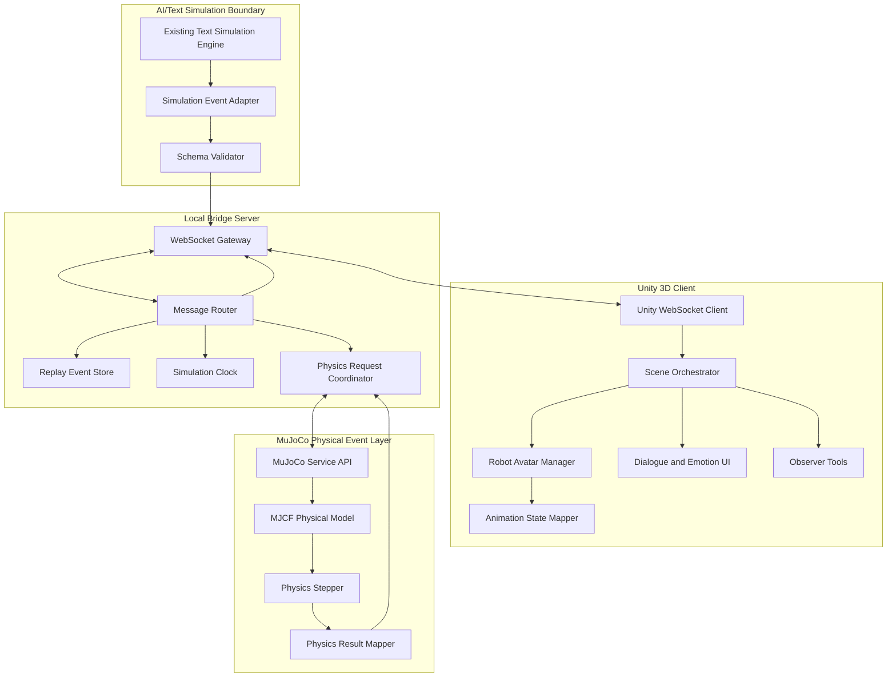

# Architecture

> **DEPRECATED:** MuJoCo integration has been removed. Deterministic local fallback is now the sole physics backend. This document is preserved for historical context.

## System Context

AI Unity MuJoCo Bridge sits between an already implemented text-based population simulation and a Unity 3D visualization client. The bridge translates high-level simulation events into stable, versioned messages that Unity can render and that MuJoCo can evaluate when physical outcomes are needed.

The system interacts with these external or separate systems:

- Existing text simulation engine: source of agent cognition, dialogue, emotion, group dynamics, and high-level actions.
- Unity 3D project: visualizes agents as cute biped robot avatars.
- MuJoCo Python service: evaluates selected physical events.
- Optional MuJoCo Unity plug-in: future path for real-time physics inside Unity.
- Robot asset provider: Unity Asset Store, Sketchfab, or locally supplied FBX/GLB source.
- Local filesystem: replay logs, golden fixtures, configuration files, and test reports.

## Architecture Diagram



## Runtime Modes

### Mode A: Text-to-Unity Visualization

The text simulation emits events. The bridge streams them to Unity. Unity renders avatars, movement, speech bubbles, emotions, and group behavior. MuJoCo is disabled.

Use this mode first.

### Mode B: Text-to-Unity with MuJoCo Physical Events

The text simulation emits a physical event such as `push`, `block`, `fall`, or `recover`. The bridge converts it into a `physics.request`, calls the MuJoCo service, receives `physics.result`, appends the result to the replay log, and sends the result to Unity for animation blending.

Use this mode after Mode A is stable.

### Mode C: Unity with MuJoCo Plug-in

Unity imports MJCF models and uses the MuJoCo Unity plug-in for selected physical scenes. This mode is optional and must not be implemented before Mode B works.

## Module Responsibilities

### Existing Text Simulation Engine

**Purpose:** Provide authoritative social simulation results.

**Inputs:**

- Scenario configuration.
- Population/agent profiles.
- Time-step commands.
- Optional user control commands.

**Outputs:**

- Agent state snapshots.
- Dialogue events.
- Social action events.
- Relationship updates.
- Conflict intensity updates.
- Physical action intents.

**Main responsibilities:**

- Simulate thinking, memory, emotion, dialogue, and social behavior.
- Emit stable event records.
- Preserve existing text simulation semantics.

**Failure behavior:**

- If the text simulation fails, the bridge must surface a structured `simulation.error` event.
- Unity must display a non-blocking error overlay and pause new event application.

**Test strategy:**

- Existing text simulation tests remain separate.
- Bridge tests use recorded fixtures rather than modifying the simulation engine.

### Simulation Event Adapter

**Purpose:** Convert existing text simulation outputs into canonical bridge events.

**Inputs:**

- Existing event dictionaries, logs, or callback payloads.

**Outputs:**

- Versioned `BridgeEnvelope` messages.

**Main responsibilities:**

- Normalize agent IDs.
- Normalize time representation.
- Validate required fields.
- Add sequence numbers and correlation IDs.
- Preserve original event references for debugging.

**Failure behavior:**

- Invalid events become `adapter.error` messages.
- Invalid events are not sent to Unity unless explicitly configured for debug visualization.

**Test strategy:**

- Unit tests for every supported event type.
- Golden tests comparing existing text-simulation fixtures to canonical bridge messages.

### Bridge Server

**Purpose:** Coordinate communication between AI simulation, Unity, replay logs, and MuJoCo.

**Inputs:**

- Canonical AI simulation events.
- Unity messages such as ready, ack, camera control, selected agent, pause, resume, and step.
- MuJoCo physics results.

**Outputs:**

- Unity-directed event streams.
- MuJoCo physics requests.
- Replay log files.
- Health and diagnostic responses.

**Main responsibilities:**

- Maintain local WebSocket connections.
- Broadcast simulation events.
- Track message acknowledgements.
- Maintain simulation clock state.
- Route physical action intents to MuJoCo.
- Record all accepted events.

**Failure behavior:**

- Disconnects trigger reconnect state.
- Invalid messages receive structured error responses.
- If Unity is disconnected, events may be buffered up to a configured maximum.
- If MuJoCo fails, physical events degrade to deterministic animation-only fallback.

**Test strategy:**

- WebSocket integration tests.
- Reconnect and backpressure tests.
- Schema validation tests.
- Replay determinism tests.

### Unity WebSocket Client

**Purpose:** Connect Unity to the local bridge server.

**Inputs:**

- Bridge WebSocket URL.
- Optional local client token.
- Unity scene lifecycle events.

**Outputs:**

- `unity.ready`
- `unity.ack`
- `unity.error`
- `unity.command`
- `observer.selection`

**Main responsibilities:**

- Open a WebSocket connection.
- Dispatch messages on the Unity main thread.
- Parse JSON envelopes.
- Send acknowledgements.
- Reconnect with backoff.
- Notify the Scene Orchestrator.

**Failure behavior:**

- If connection fails, display local connection status.
- If message parsing fails, send `unity.error` and skip that message.
- Never freeze Unity's main thread.

**Test strategy:**

- EditMode tests for JSON parsing and dispatch.
- PlayMode tests with a local fake server.
- Manual disconnect/reconnect test.

### Scene Orchestrator

**Purpose:** Apply bridge events to Unity scene state.

**Inputs:**

- Parsed bridge messages.
- User camera and observer controls.

**Outputs:**

- Avatar spawn/despawn commands.
- Transform updates.
- UI updates.
- Animation state transitions.

**Main responsibilities:**

- Maintain map from `agent_id` to robot instance.
- Apply movement events in sequence.
- Handle dialogue bubbles.
- Show emotion and conflict status.
- Expose timeline and selected-agent overlays.

**Failure behavior:**

- Unknown agent reference triggers lazy spawn if enabled.
- Invalid transform is clamped or rejected according to config.
- Out-of-order events are buffered or skipped based on sequence policy.

**Test strategy:**

- PlayMode tests for spawn, movement, dialogue, and emotion rendering.
- Snapshot-like scene state assertions.

### Robot Avatar Manager

**Purpose:** Manage cute biped robot prefab instances.

**Inputs:**

- Agent state events.
- Asset configuration.
- Spawn positions and animation states.

**Outputs:**

- Unity GameObjects.
- Animation parameter updates.
- Visual identity changes.

**Main responsibilities:**

- Instantiate robot prefab.
- Assign agent labels.
- Apply colors or badges for factions/groups.
- Maintain scale and orientation.
- Drive Animator states.

**Failure behavior:**

- If the selected asset is missing, instantiate a simple fallback capsule robot and surface a warning.
- If animation state is missing, fall back to idle.

**Test strategy:**

- Asset import validation checklist.
- PlayMode spawn tests.
- Animator parameter tests.

### MuJoCo Physics Service

**Purpose:** Evaluate selected physical events in a deterministic physics layer.

**Inputs:**

- `PhysicsRequest`
- MJCF model path.
- Agent physical state.
- Event intensity and constraints.

**Outputs:**

- `PhysicsResult`
- outcome labels such as `stumble`, `fall`, `recover`, `blocked`, `no_contact`.
- final pose summary.
- confidence and warnings.

**Main responsibilities:**

- Load MJCF physical model.
- Map abstract agent states to simplified bodies.
- Step simulation for configured duration.
- Return physical outcome summary.
- Avoid graphical or injury detail.

**Failure behavior:**

- Missing MJCF model returns `physics.error`.
- Invalid request returns validation error.
- Timeout returns fallback physical outcome and warning.

**Test strategy:**

- Deterministic push/fall fixture.
- Timeout test.
- Invalid request test.
- Repeatability test with fixed seed.

### Replay Event Store

**Purpose:** Preserve every accepted simulation event and generated result for replay and debugging.

**Inputs:**

- Accepted bridge envelopes.
- Acknowledgements.
- Physics results.
- Error events.

**Outputs:**

- JSONL replay logs.
- Golden test fixtures.
- Replay summaries.

**Main responsibilities:**

- Append immutable event records.
- Maintain session metadata.
- Support replay from event log.
- Support deterministic golden test comparison.

**Failure behavior:**

- If writing fails, bridge continues only if configured `allow_unlogged_runtime=true`; otherwise pause simulation.
- Log errors must be surfaced to Unity and CLI.

**Test strategy:**

- File append tests.
- Replay round-trip tests.
- Corrupted log handling tests.

## Data Flow

1. The existing text simulation emits a raw event.
2. The Simulation Event Adapter converts it into a canonical event.
3. The Schema Validator validates the event.
4. The Bridge Server wraps the event in a `BridgeEnvelope`.
5. The Replay Event Store appends the event.
6. The Message Router checks whether the event needs MuJoCo.
7. If MuJoCo is not needed, the WebSocket Gateway sends it directly to Unity.
8. If MuJoCo is needed:
   - the Physics Request Coordinator creates `PhysicsRequest`,
   - MuJoCo evaluates the event,
   - MuJoCo returns `PhysicsResult`,
   - the result is appended to the replay log,
   - Unity receives both the original physical intent and the physical result.
9. Unity acknowledges message receipt.
10. Unity applies scene updates through the Scene Orchestrator.

## Control Flow

```txt
idle
  -> bridge_starting
  -> waiting_for_unity
  -> unity_connected
  -> simulation_loading
  -> simulation_running
       -> physics_pending
       -> physics_completed
       -> event_rendered
  -> simulation_paused
  -> simulation_completed

failure transitions:
  bridge_starting -> failed
  unity_connected -> unity_disconnected
  physics_pending -> physics_failed -> animation_fallback
  simulation_running -> simulation_error -> paused
```

## Error Handling Strategy

Errors are represented as structured messages.

Required fields:

```txt
error_id
source
severity
message
recoverable
correlation_id
details
```

Severity values:

- `debug`
- `info`
- `warning`
- `error`
- `fatal`

Recovery rules:

- Schema errors reject the event.
- Unity parse errors skip one message and continue.
- MuJoCo timeout degrades to animation-only fallback.
- Replay write failure pauses by default.
- Bridge server fatal error terminates with non-zero exit code.

## Configuration Strategy

Configuration must be file-first and environment-overridable.

Expected files:

```txt
configs/bridge.example.yaml
configs/robot-assets.example.yaml
configs/scenarios/*.yaml
```

Important config groups:

- `server`: host, port, allowed clients.
- `schema`: version, strict mode, unknown field policy.
- `unity`: reconnect, buffer size, acknowledgement timeout.
- `mujoco`: enabled, model path, step count, timeout, fallback mode.
- `replay`: output directory, session naming, retention.
- `assets`: selected robot asset, attribution, expected prefab path.
- `safety`: physical event intensity limits and banned event classes.

Secrets:

- Do not require secrets for local mode.
- If tokens are added later, read them from environment variables only.

## Performance Considerations

Expected bottlenecks:

- LLM/text simulation step latency.
- WebSocket burst traffic during dense population events.
- Unity main-thread object instantiation.
- MuJoCo simulation cost for multiple humanoid bodies.
- JSON serialization overhead for large snapshots.

Optimization boundaries:

- Do not optimize before correctness and replay determinism.
- Use event deltas instead of full snapshots after the MVP.
- Use Level-of-Detail avatar updates for large crowds.
- Use MuJoCo only for selected physical events, not every frame.
- Pool Unity robot prefabs and dialogue UI elements.
- Batch non-critical visual updates per frame.

Target MVP performance:

- 20 active visible agents.
- 5 physical events per minute.
- 10 simulation events per second sustained.
- WebSocket round-trip acknowledgement under 250 ms on localhost.
- Unity maintains at least 30 FPS in MVP scene.

## Security and Safety Considerations

- Localhost-only by default.
- Reject non-local connections unless explicitly configured.
- Validate every incoming message.
- Limit payload size.
- Reject unknown schema major versions.
- Do not log private agent profiles by default.
- Do not expose raw LLM prompts or hidden chain data to Unity.
- Do not simulate graphic injury or real-world instructions for harm.
- Use abstract physical outcomes only.
- Do not let Unity execute code received from the bridge.
- Do not download third-party assets at runtime.
- Track all third-party licenses.

## Extensibility

Add new event types by:

1. Updating schema definitions.
2. Adding adapter mapping.
3. Adding bridge routing behavior.
4. Adding Unity handler.
5. Adding replay/golden tests.
6. Updating documentation and changelog.

Add new physics backends by implementing the same physical event interface:

```txt
PhysicalEventBackend
  - evaluate(request) -> result
  - health() -> status
  - close() -> none
```

Add new visual clients by implementing the same WebSocket protocol and acknowledgement behavior.

Add new robot models by adding a new asset manifest entry and passing the import validation checklist.
