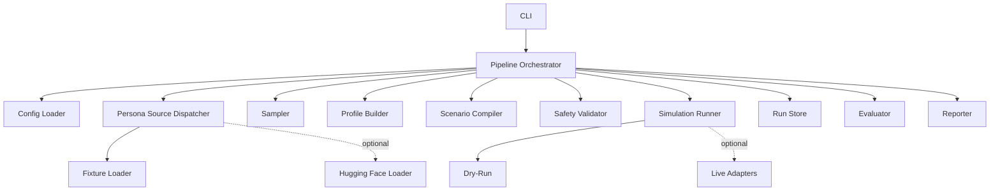

# Repository Stabilization Design

## Overview

The design keeps the existing modular structure and adds reliable orchestration. The first milestone is a deterministic offline dry-run pipeline. Optional Hugging Face, PageIndex, Concordia, and NVIDIA NIM integrations must stay isolated.

## Architecture



## Components

### CLI Layer

Responsibility: expose commands, parse options, call orchestrator, map typed errors to exit codes.

Public commands:

```txt
kssim validate-config --config PATH
kssim sample --config PATH --output PATH
kssim compile-scenario --config PATH --output PATH
kssim run --config PATH [--dry-run]
kssim evaluate --events PATH --config PATH
kssim report --input PATH --output PATH
```

Failure behavior: concise user-facing error; no secrets; non-zero exit.

### Pipeline Orchestrator

Responsibility: coordinate modules without embedding business logic in CLI.

Suggested operations:

```txt
validate_config_command(config_path)
sample_command(config_path, output_path)
compile_scenario_command(config_path, output_path)
run_command(config_path, dry_run_override)
evaluate_command(events_path, config_path)
report_command(input_path, output_path)
```

### Persona Source Dispatcher

Responsibility: choose fixture or Hugging Face loading from `DatasetConfig.mode`.

Rules:

- fixture mode never uses network,
- HF mode requires `datasets`,
- missing dependency raises actionable `DatasetLoadError`.

### Scenario Compiler

Responsibility: validate family, attach metrics, propagate dry-run mode, attach available RAG context.

Required fix: do not hard-code `dry_run=True`.

### Safety Validator

Responsibility: fail closed for prohibited objectives.

Must inspect:

- title,
- hypothesis,
- interventions,
- allowed objective if present,
- profile background,
- goals,
- behavior rules.

Korean prohibited phrases should include equivalents for political persuasion, voter manipulation, real-person profiling, protected group targeting, social engineering, and fake public opinion.

### Simulation Runner

Responsibility: return events and status.

Recommended contract:

```python
class SimulationExecution:
    run_id: str
    status: Literal["success", "partial", "failed", "blocked"]
    events: list[SimulationEvent]
    warnings: list[str]
    errors: list[str]
```

Dry-run must use no network. Live adapter events must not be discarded.

### Run Store

Responsibility: write stable artifacts.

Target tree:

```txt
outputs/<run_id>/
  run_metadata.json
  sample.json
  profiles.json
  plan.json
  events.jsonl
  metrics.json
  metrics.csv
  report.md
```

### Evaluator

Responsibility: compute deterministic structural metrics and record unavailable metrics.

### Reporter

Responsibility: render report with summary, metrics, event examples, safety notes, warnings, errors, limitations, and follow-up validation.

## Data Models

Existing models remain canonical:

```python
class PersonaRecord: ...
class PopulationSample: ...
class AgentProfile: ...
class ScenarioSpec: ...
class SimulationPlan: ...
class SimulationEvent: ...
class MetricsResult: ...
class SimulationResult: ...
```

Recommended addition: `SimulationExecution` for returning events + status.

## Algorithms

### Offline Run

1. Load config.
2. Create run store.
3. Load personas.
4. Sample personas.
5. Write sample.
6. Build profiles.
7. Write profiles.
8. Compile scenario.
9. Write plan.
10. Validate safety.
11. Run dry-run.
12. Write events.
13. Evaluate metrics.
14. Write metrics.
15. Render report.
16. Write report.
17. Finalize metadata.

### Evaluate

1. Load config.
2. Read events JSONL.
3. Validate events.
4. Evaluate configured metrics.
5. Write metrics artifacts.

### Report

1. Load run metadata if present.
2. Load events and metrics.
3. Render deterministic Markdown.
4. Write output path.

## State Flow

```txt
initialized -> config_loaded -> personas_loaded -> sampled -> profiles_built
-> scenario_compiled -> safety_validated -> simulation_completed
-> events_written -> metrics_written -> report_written -> finalized
```

Failure paths: `failed`, `blocked`, `partial`.

## Configuration

Required correction: example scenario family should be supported. Preferred minimal fix:

```yaml
scenario:
  family: product_market
```

Env overrides must map only to declared Pydantic fields.

## Storage

Output must stay under configured `runtime.output_dir`. Run IDs should be validated or sanitized to prevent path traversal.

## Error Handling

Recommended CLI mapping:

| Error | Prefix |
|---|---|
| `ConfigurationError` | Configuration error |
| `DatasetLoadError` | Dataset load error |
| `PersonaSchemaError` | Persona schema error |
| `SamplingError` | Sampling error |
| `ScenarioValidationError` | Scenario validation error |
| `SafetyViolationError` | Safety violation |
| `StorageError` | Storage error |
| `SimulationError` | Simulation error |
| `EvaluationError` | Evaluation error |

## Logging and Observability

Metadata should include run ID, status, scenario family, dry-run flag, sample size, agent count, turn count, event count, metric count, warnings, errors, and artifact paths.

## Testing Design

- Unit: schemas, loaders, sampler, profiles, compiler, safety, dry-run, metrics, report, store.
- Integration: CLI command paths.
- Smoke: full offline run.
- Golden: report and metrics.
- Live: marked and optional.

## Non-Goals

- No web UI.
- No real-world prediction scoring.
- No political persuasion support.
- No mandatory live adapters.
- No fine-tuning or training dataset generation in this milestone.

## Open Questions and Assumptions

1. Use `product_market` instead of adding `product_reaction` alias unless owner prefers alias.
2. Keep PageIndex mocked until offline MVP is verified.
3. Keep NVIDIA-specific key separate from generic future LLM config.
4. Normalize timestamps in golden tests.
